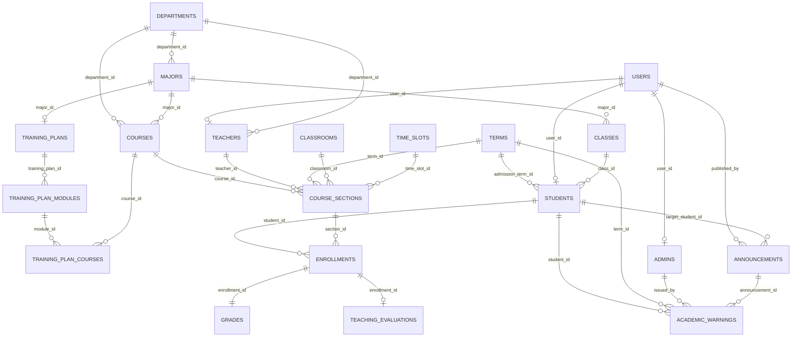

# 数据库设计与 ER 说明

## 1. 文档范围与依据

本文档严格基于当前仓库中的实际实现编写，主要依据以下文件：

- `sql/schema.sql`
- `sql/database.sql`
- `scripts/init-db.js`
- `scripts/seed-db.js`
- `routes/*.js`
- `services/*.js`
- `utils/*.js`

因此，本文档描述的是“当前代码已经落地的数据库设计”，而不是抽象的理想设计。

## 2. 当前数据库初始化方式

### 2.1 初始化入口

项目通过以下命令初始化数据库：

```bash
npm run init-db
```

执行链路如下：

1. `scripts/init-db.js` 读取 `sql/database.sql` 创建数据库
2. 读取 `sql/schema.sql` 创建全部业务表、主键、外键、索引、检查约束
3. 调用 `scripts/seed-db.js` 生成并写入演示数据

### 2.2 关于 `seed.sql`

`sql/seed.sql` 当前不是实际数据导入入口，它只保留说明性注释。真正的种子数据来自 `scripts/seed-db.js`。这样做的原因是：

- 种子数据跨表关系复杂
- 编号、开课、成绩、培养方案、评价等需要程序化生成
- 可以保证示例数据始终与最新 schema 保持同步

### 2.3 运行时附加表

项目使用 `express-mysql-session` 保存 Session。运行时中间件可能会自动创建会话表，例如 `sessions`。该表不属于 `schema.sql` 中定义的核心业务表，因此本文档重点说明业务数据库，不将 Session 存储表纳入核心 ER 范围。

## 3. 数据库设计目标

本系统数据库设计重点解决以下问题：

- 三端共享统一数据源
- 课程目录与开课实例分离
- 账号基础信息与角色扩展信息分离
- 培养方案、课程、成绩、选课状态可联动
- 尽量避免删除异常、增加异常、修改异常
- 禁止把业务删除动作设计成危险的级联删除
- 对关键业务规则增加数据库层保护

## 4. 总体建模原则

### 4.1 主键策略

所有核心表统一使用：

- `INT AUTO_INCREMENT` 作为主键

优点：

- 关联简单
- 联表成本低
- 与 Node.js/MySQL 驱动交互直接

### 4.2 外键策略

系统对关键业务关系全部使用显式外键。设计原则是：

- 关键主从关系使用 `ON DELETE RESTRICT`
- 仅对“弱引用展示字段”使用 `SET NULL`
- 不用数据库级联删除去代替业务层逻辑

### 4.3 唯一约束策略

凡是业务上“只能出现一次”的关系，都设计唯一约束。例如：

- 用户名唯一
- 学号唯一
- 工号唯一
- 课程号唯一
- 同一学生对同一开课只能有一条选课记录
- 同一选课记录只能有一条成绩记录
- 同一培养方案中同一课程不能重复出现

### 4.4 检查约束策略

当前 schema 中大量使用了 `CHECK` 约束，例如：

- 日期先后顺序
- 学分和学时必须为正数
- 成绩必须在 0 到 100
- 绩点必须在 0 到 4
- 开课成绩权重之和必须等于 100

### 4.5 编码冗余但受约束一致

有些字段是“为了查询方便而保留冗余”，但通过约束保证一致。例如：

- `courses.department_id`
- `courses.major_id`

课程既保存所属院系，也保存所属专业。这样前端可以直接按院系、专业过滤课程，同时又通过组合外键确保 `major_id` 与 `department_id` 一致，不会出现“课程属于错误院系”的脏数据。

## 5. ER 关系总览

下面的 ER 图展示的是核心业务关系，不包含所有索引与全部约束细节：



## 6. 业务表总览

| 表名 | 中文名称 | 类型 | 主要职责 |
|---|---|---|---|
| `terms` | 学期表 | 基础主数据 | 维护教学周期、选课窗口、当前学期状态 |
| `departments` | 院系表 | 基础主数据 | 维护院系编码与名称 |
| `majors` | 专业表 | 基础主数据 | 维护专业、所属院系及专业编码 |
| `classes` | 班级表 | 基础主数据 | 维护班级、年级、辅导员信息 |
| `users` | 用户账号表 | 身份主数据 | 保存登录账号、角色、密码哈希和联系方式 |
| `students` | 学生档案表 | 身份扩展数据 | 保存学生学号、班级、入学信息和毕业要求学分 |
| `teachers` | 教师档案表 | 身份扩展数据 | 保存工号、职称、院系、办公地点等 |
| `admins` | 管理员档案表 | 身份扩展数据 | 保存管理员编号和岗位信息 |
| `classrooms` | 教室表 | 资源主数据 | 维护教室资源、楼宇、容量、类型 |
| `time_slots` | 时间段表 | 资源主数据 | 维护标准上课节次和时间标签 |
| `courses` | 课程目录表 | 教学主数据 | 定义课程本身，而非某次开课 |
| `training_plans` | 培养方案表 | 教学主数据 | 定义某专业的培养方案头信息 |
| `training_plan_modules` | 培养方案模块表 | 教学主数据 | 定义培养方案中的模块结构 |
| `training_plan_courses` | 培养方案课程映射表 | 教学主数据 | 维护课程与培养方案模块的映射 |
| `announcements` | 公告表 | 消息数据 | 维护面向全体或特定角色/学生的公告 |
| `course_sections` | 开课表 | 教学业务数据 | 定义某课程在某学期的一次具体开课 |
| `enrollments` | 选课表 | 教学业务数据 | 记录学生是否选了某个开课 |
| `grades` | 成绩表 | 教学业务数据 | 记录某次选课的成绩详情与发布状态 |
| `teaching_evaluations` | 教学评价表 | 教学业务数据 | 记录学生对课程/教师的评价 |
| `academic_warnings` | 学业预警表 | 管理业务数据 | 记录管理员发出的学业预警 |

## 7. 各表详细说明

下文中每张表都按以下维度说明：

- 表定位
- 关系说明
- 每个字段的详细含义
- 索引与唯一约束
- 外键与删除策略
- 在当前代码中的典型使用方式

---

## 7.1 `terms`

### 7.1.1 表定位

`terms` 表用于维护学期，是很多业务判断的基准表。它不仅表示“学年学期名称”，还承载：

- 当前学期判断
- 教学周期范围
- 选课窗口范围
- 学期状态（规划中 / 进行中 / 已归档）

学生端、教师端、管理员端的大量页面都会读取当前学期。

### 7.1.2 关系说明

- 被 `students.admission_term_id` 引用
- 被 `course_sections.term_id` 引用
- 被 `academic_warnings.term_id` 引用

### 7.1.3 字段说明

| 字段 | 类型 | 可空 | 默认值 | 键/约束 | 详细说明 |
|---|---|---|---|---|---|
| `id` | `INT` | 否 | 自增 | 主键 | 学期主键，系统内部统一使用该字段关联学期。 |
| `name` | `VARCHAR(80)` | 否 | 无 | 唯一 | 学期完整显示名称，如“2025-2026 学年第二学期”。用于页面展示、下拉框显示、公告和统计。 |
| `academic_year` | `VARCHAR(20)` | 否 | 无 | 参与唯一键 | 学年标识，如“2025-2026”。用于与 `semester_label` 组成业务唯一标识。 |
| `semester_label` | `VARCHAR(20)` | 否 | 无 | 参与唯一键 | 学期标签，如“第一学期”“第二学期”。用于管理员维护和界面展示。 |
| `start_date` | `DATE` | 否 | 无 | `chk_terms_date_order` | 教学开始日期。用于推导当前学期、计算学生当前处于第几学期等。 |
| `end_date` | `DATE` | 否 | 无 | `chk_terms_date_order` | 教学结束日期。要求不早于开始日期。 |
| `selection_start` | `DATE` | 否 | 无 | `chk_terms_selection_order`、`chk_terms_selection_range` | 选课开始日期。虽然学生端当前主要依赖“当前学期+开课状态”，但该字段是完整教务周期设计的一部分。 |
| `selection_end` | `DATE` | 否 | 无 | `chk_terms_selection_order`、`chk_terms_selection_range` | 选课结束日期。必须不早于 `selection_start`，且与教学周期有交集。 |
| `is_current` | `TINYINT(1)` | 否 | `0` | 索引 `idx_terms_current_start` | 是否为当前学期。代码通过 `getCurrentTerm()` 查找 `is_current = 1` 的记录。业务上应只有一个当前学期，但数据库未加唯一约束，靠管理端规则维持。 |
| `status` | `ENUM('规划中','进行中','已归档')` | 否 | `'进行中'` | 枚举约束 | 学期业务状态。管理员端要求：如果 `is_current = 1`，则状态必须是“进行中”。 |
| `created_at` | `DATETIME` | 否 | `CURRENT_TIMESTAMP` | 无 | 学期记录创建时间。 |
| `updated_at` | `DATETIME` | 否 | `CURRENT_TIMESTAMP ON UPDATE CURRENT_TIMESTAMP` | 无 | 学期记录最后更新时间。 |

### 7.1.4 索引与约束

- `PRIMARY KEY (id)`
- `UNIQUE (name)`：完整名称不可重复
- `UNIQUE uk_terms_year_label (academic_year, semester_label)`：同一学年下同类学期不可重复
- `KEY idx_terms_current_start (is_current, start_date)`：支持快速获取当前学期并按时间排序

检查约束：

- `start_date <= end_date`
- `selection_start <= selection_end`
- 选课窗口必须与教学周期有交集

### 7.1.5 代码中的主要用途

- `services/referenceService.js`：`getCurrentTerm()`、`getTerms()`
- `middlewares/locals.js`：每次请求都尝试注入当前学期
- `routes/student.js`：选课、课表、培养方案等都依赖当前学期
- `routes/admin.js`：学期管理页、当前学期校验、开课维护

---

## 7.2 `departments`

### 7.2.1 表定位

`departments` 是院系主数据表，提供院系编码、英文/业务代码、中文名称和描述。其信息会被多个场景使用：

- 专业归属
- 教师归属
- 课程归属
- 学号/工号生成

### 7.2.2 关系说明

- 被 `majors.department_id` 引用
- 被 `teachers.department_id` 引用
- 被 `courses.department_id` 引用

### 7.2.3 字段说明

| 字段 | 类型 | 可空 | 默认值 | 键/约束 | 详细说明 |
|---|---|---|---|---|---|
| `id` | `INT` | 否 | 自增 | 主键 | 院系主键。 |
| `department_no` | `CHAR(2)` | 否 | 无 | 唯一 | 院系两位编号，如 `21`、`31`、`41`。学生学号和教师工号生成会直接使用该字段。 |
| `code` | `VARCHAR(20)` | 否 | 无 | 唯一 | 院系代码，如 `CST`、`MATH`、`GE`。用于展示、维护和可能的外部标识。 |
| `name` | `VARCHAR(80)` | 否 | 无 | 无 | 院系中文名称，如“计算机科学与技术学院”。 |
| `description` | `TEXT` | 是 | `NULL` | 无 | 院系说明，用于描述院系职责。 |
| `created_at` | `DATETIME` | 否 | `CURRENT_TIMESTAMP` | 无 | 创建时间。 |
| `updated_at` | `DATETIME` | 否 | `CURRENT_TIMESTAMP ON UPDATE CURRENT_TIMESTAMP` | 无 | 更新时间。 |

### 7.2.4 索引与约束

- `PRIMARY KEY (id)`
- `UNIQUE (department_no)`
- `UNIQUE (code)`

### 7.2.5 删除策略

- 被专业、教师、课程引用时不可删除
- 外键使用 `ON DELETE RESTRICT`

### 7.2.6 代码中的主要用途

- 基础信息维护
- 编号生成上下文
- 管理端课程、教师、专业的筛选与显示

---

## 7.3 `majors`

### 7.3.1 表定位

`majors` 表保存专业主数据，是“院系 -> 专业 -> 班级 -> 学生”的中间层，同时也是培养方案的归属对象。系统当前的培养方案就是按专业维度维护，而不是按班级维护。

### 7.3.2 关系说明

- 从属于 `departments`
- 被 `classes.major_id` 引用
- 被 `courses.major_id` 引用
- 被 `training_plans.major_id` 引用

### 7.3.3 字段说明

| 字段 | 类型 | 可空 | 默认值 | 键/约束 | 详细说明 |
|---|---|---|---|---|---|
| `id` | `INT` | 否 | 自增 | 主键 | 专业主键。 |
| `department_id` | `INT` | 否 | 无 | 外键 | 所属院系 ID。决定专业归属，也影响课程一致性约束。 |
| `major_code` | `CHAR(2)` | 否 | 无 | 参与唯一键 | 专业在院系内的两位编号，如 `01`、`02`、`03`。 |
| `code` | `VARCHAR(20)` | 否 | 无 | 唯一 | 专业代码，如 `CS`、`SE`、`AI`、`MATH`、`GE`。课程号生成会使用该字段。 |
| `name` | `VARCHAR(80)` | 否 | 无 | 无 | 专业名称，如“计算机科学与技术”。 |
| `description` | `TEXT` | 是 | `NULL` | 无 | 专业说明。 |
| `created_at` | `DATETIME` | 否 | 当前时间 | 无 | 创建时间。 |
| `updated_at` | `DATETIME` | 否 | 自动更新时间 | 无 | 更新时间。 |

### 7.3.4 索引与约束

- `UNIQUE uk_majors_department_code (department_id, major_code)`：同院系下专业编号唯一
- `UNIQUE (code)`：专业代码全局唯一
- `KEY idx_majors_department_name (department_id, name)`：支持按院系和名称检索
- `KEY idx_majors_id_department (id, department_id)`：为课程表组合外键提供被引用索引

### 7.3.5 删除策略

- 如果仍有关联班级、课程或培养方案，不能删除
- 通过业务层先检查，再由外键阻止非法删除

### 7.3.6 代码中的主要用途

- 基础信息管理中的专业维护
- 课程归属
- 培养方案归属
- 课程号生成
- 班级名称生成

---

## 7.4 `classes`

### 7.4.1 表定位

`classes` 表表示行政班，是学生归属的直接对象。学生不直接挂在专业上，而是先归属到班级，再由班级关联专业。

### 7.4.2 关系说明

- 从属于 `majors`
- 被 `students.class_id` 引用

### 7.4.3 字段说明

| 字段 | 类型 | 可空 | 默认值 | 键/约束 | 详细说明 |
|---|---|---|---|---|---|
| `id` | `INT` | 否 | 自增 | 主键 | 班级主键。 |
| `major_id` | `INT` | 否 | 无 | 外键 | 班级所属专业。 |
| `class_code` | `CHAR(2)` | 否 | 无 | 参与唯一键 | 班级编号，两位字符串，如 `01`、`02`。学号生成会用到。 |
| `class_name` | `VARCHAR(80)` | 否 | 无 | 参与唯一键 | 班级显示名称，如“计算机科学与技术 2023级1班”。 |
| `grade_year` | `INT` | 否 | 无 | 参与唯一键/索引 | 年级年份，如 `2023`。用于学号和入学相关推导。 |
| `counselor_name` | `VARCHAR(80)` | 是 | `NULL` | 无 | 辅导员姓名。 |
| `created_at` | `DATETIME` | 否 | 当前时间 | 无 | 创建时间。 |
| `updated_at` | `DATETIME` | 否 | 自动更新时间 | 无 | 更新时间。 |

### 7.4.4 索引与约束

- `UNIQUE uk_classes_name (major_id, grade_year, class_name)`：同专业同年级下班级名唯一
- `INDEX idx_classes_grade_code (grade_year, class_code)`：支撑按年级和班号的快速检索；“同年级同学院下班号唯一”由写入逻辑结合 `majors.department_id` 严格校验，避免在 `classes` 表冗余存储学院字段而引入同步异常
- `KEY idx_classes_major_grade (major_id, grade_year)`：支持按专业和年级查班级

### 7.4.5 代码中的主要用途

- 学生归属班级
- 学号生成
- 学生新增/编辑时的班级选择
- 班级维护与学生关联检查

---

## 7.5 `users`

### 7.5.1 表定位

`users` 是统一账号表，负责保存所有角色共有的登录与基础资料。系统登录时首先查的就是该表，而不是直接查学生或教师档案表。

### 7.5.2 关系说明

- 与 `students` 一对一
- 与 `teachers` 一对一
- 与 `admins` 一对一
- 被 `announcements.published_by` 引用

### 7.5.3 字段说明

| 字段 | 类型 | 可空 | 默认值 | 键/约束 | 详细说明 |
|---|---|---|---|---|---|
| `id` | `INT` | 否 | 自增 | 主键 | 用户主键。 |
| `username` | `VARCHAR(50)` | 否 | 无 | 唯一 | 登录账号，如 `admin01`、`t_chen`、`s_2023001`。 |
| `password_hash` | `VARCHAR(255)` | 否 | 无 | 无 | BCrypt 密码哈希，不保存明文密码。 |
| `role` | `ENUM('student','teacher','admin')` | 否 | 无 | 枚举 | 角色标识，控制 RBAC、导航和登录身份切换。 |
| `full_name` | `VARCHAR(80)` | 否 | 无 | 索引 `idx_users_full_name` | 用户真实姓名。 |
| `email` | `VARCHAR(100)` | 是 | `NULL` | 无 | 邮箱。当前系统主要用于资料展示，不做邮件发送。 |
| `phone` | `VARCHAR(20)` | 是 | `NULL` | 无 | 手机号。 |
| `status` | `ENUM('启用','停用')` | 否 | `'启用'` | 索引 `idx_users_role_status` | 账号状态。停用账号不能登录。 |
| `avatar_color` | `VARCHAR(20)` | 否 | `'#146356'` | 无 | 头像色值，用于页面顶部头像和身份视觉区分。 |
| `last_login_at` | `DATETIME` | 是 | `NULL` | 无 | 最近一次登录时间。登录成功后会更新。 |
| `created_at` | `DATETIME` | 否 | 当前时间 | 无 | 创建时间。 |
| `updated_at` | `DATETIME` | 否 | 自动更新时间 | 无 | 更新时间。 |

### 7.5.4 索引与约束

- `UNIQUE (username)`
- `KEY idx_users_role_status (role, status)`：账号管理页筛选使用
- `KEY idx_users_full_name (full_name)`：模糊搜索姓名时受益

### 7.5.5 代码中的主要用途

- `routes/auth.js`：登录认证
- `services/userService.js`：会话用户对象组装
- `routes/admin.js`：账号管理、重置密码、停用/启用账号

---

## 7.6 `students`

### 7.6.1 表定位

`students` 表保存学生身份专有字段。系统把登录数据与学生档案拆开，避免 `users` 表塞入过多角色专属字段。

### 7.6.2 关系说明

- `user_id -> users.id`
- `class_id -> classes.id`
- `admission_term_id -> terms.id`
- 被 `announcements.target_student_id` 引用
- 被 `enrollments.student_id` 引用
- 被 `teaching_evaluations.student_id` 引用
- 被 `academic_warnings.student_id` 引用

### 7.6.3 字段说明

| 字段 | 类型 | 可空 | 默认值 | 键/约束 | 详细说明 |
|---|---|---|---|---|---|
| `id` | `INT` | 否 | 自增 | 主键 | 学生档案主键。很多学生业务以它作为 `profileId`。 |
| `user_id` | `INT` | 否 | 无 | 唯一外键 | 对应 `users.id`。保证一个账号最多一个学生档案。 |
| `student_no` | `CHAR(8)` | 否 | 无 | 唯一 | 学号。由院系编号 + 入学年份后两位 + 班级编号 + 班内序号组成。 |
| `gender` | `ENUM('男','女','其他')` | 是 | `NULL` | 枚举 | 性别。 |
| `class_id` | `INT` | 否 | 无 | 外键 | 学生所属班级。 |
| `class_serial` | `CHAR(2)` | 否 | 无 | 索引 | 学生在班内的两位流水序号，如 `01`、`02`。学号生成直接使用。 |
| `entry_year` | `INT` | 否 | 无 | 索引 | 入学年份。培养方案当前处于第几学期的推导会用到。 |
| `admission_term_id` | `INT` | 是 | `NULL` | 外键 | 入学学期 ID。当前种子数据里会根据年级解析首个学期。 |
| `birth_date` | `DATE` | 是 | `NULL` | 无 | 出生日期。 |
| `address` | `VARCHAR(255)` | 是 | `NULL` | 无 | 地址或宿舍信息。 |
| `credits_required` | `DECIMAL(5,1)` | 否 | `150.0` | 无 | 毕业所需学分。对于已有培养方案的专业，该值会由服务层自动同步为培养方案总学分；没有培养方案时默认 `160` 或表默认值。 |
| `created_at` | `DATETIME` | 否 | 当前时间 | 无 | 创建时间。 |
| `updated_at` | `DATETIME` | 否 | 自动更新时间 | 无 | 更新时间。 |

### 7.6.4 索引与约束

- `UNIQUE (user_id)`
- `UNIQUE (student_no)`
- `KEY idx_students_class_entry (class_id, entry_year)`
- `KEY idx_students_class_serial (class_id, class_serial)`
- `KEY idx_students_admission_term (admission_term_id)`

### 7.6.5 删除策略

- 删除学生时，如果有关联选课、评价、公告定向、预警等数据，业务层会先检查
- `class_id` 与 `user_id` 使用 `RESTRICT`
- `admission_term_id` 使用 `SET NULL`，因为入学学期属于弱引用展示信息

### 7.6.6 代码中的主要用途

- 选课与课表
- 培养方案完成度
- 学业预警
- 学生学业详情
- 会话用户 `profileId`

---

## 7.7 `teachers`

### 7.7.1 表定位

`teachers` 保存教师身份专属字段，用于教师业务、开课归属和评价归属。

### 7.7.2 关系说明

- `user_id -> users.id`
- `department_id -> departments.id`
- 被 `course_sections.teacher_id` 引用
- 被 `teaching_evaluations.teacher_id` 引用

### 7.7.3 字段说明

| 字段 | 类型 | 可空 | 默认值 | 键/约束 | 详细说明 |
|---|---|---|---|---|---|
| `id` | `INT` | 否 | 自增 | 主键 | 教师档案主键。教师端业务以它作为 `profileId`。 |
| `user_id` | `INT` | 否 | 无 | 唯一外键 | 对应用户账号。一个账号只能有一个教师档案。 |
| `teacher_no` | `VARCHAR(20)` | 否 | 无 | 唯一 | 工号。通过院系编号和年份自动生成。 |
| `gender` | `ENUM('男','女','其他')` | 是 | `NULL` | 枚举 | 性别。 |
| `birth_date` | `DATE` | 是 | `NULL` | 无 | 出生日期。 |
| `address` | `VARCHAR(255)` | 是 | `NULL` | 无 | 地址或居住信息。 |
| `department_id` | `INT` | 否 | 无 | 外键 | 所属院系。 |
| `title` | `VARCHAR(40)` | 是 | `NULL` | 无 | 职称，如讲师、副教授。 |
| `office_location` | `VARCHAR(80)` | 是 | `NULL` | 无 | 办公地点。 |
| `specialty_text` | `VARCHAR(120)` | 是 | `NULL` | 无 | 研究方向或授课特长说明。 |
| `created_at` | `DATETIME` | 否 | 当前时间 | 无 | 创建时间。 |
| `updated_at` | `DATETIME` | 否 | 自动更新时间 | 无 | 更新时间。 |

### 7.7.4 索引与约束

- `UNIQUE (user_id)`
- `UNIQUE (teacher_no)`
- `KEY idx_teachers_department (department_id)`

### 7.7.5 代码中的主要用途

- 教师教学任务
- 开课归属
- 成绩册归属
- 评价归属
- 工号生成与展示

---

## 7.8 `admins`

### 7.8.1 表定位

`admins` 是管理员身份扩展表，字段少但很重要，因为学业预警的签发人引用的是 `admins.id`，不是 `users.id`。

### 7.8.2 关系说明

- `user_id -> users.id`
- 被 `academic_warnings.issued_by` 引用

### 7.8.3 字段说明

| 字段 | 类型 | 可空 | 默认值 | 键/约束 | 详细说明 |
|---|---|---|---|---|---|
| `id` | `INT` | 否 | 自增 | 主键 | 管理员档案主键。 |
| `user_id` | `INT` | 否 | 无 | 唯一外键 | 对应登录账号。 |
| `admin_no` | `VARCHAR(20)` | 否 | 无 | 唯一 | 管理员编号。 |
| `position` | `VARCHAR(80)` | 是 | `NULL` | 无 | 岗位名称，如“教务处管理员”。 |
| `created_at` | `DATETIME` | 否 | 当前时间 | 无 | 创建时间。 |
| `updated_at` | `DATETIME` | 否 | 自动更新时间 | 无 | 更新时间。 |

### 7.8.4 代码中的主要用途

- 管理员顶部身份展示
- 学业预警签发人归属

---

## 7.9 `classrooms`

### 7.9.1 表定位

`classrooms` 是教室资源表，管理端可维护教室，开课时选择教室。系统会通过该表与时间段一起判断占用冲突。

### 7.9.2 关系说明

- 被 `course_sections.classroom_id` 引用

### 7.9.3 字段说明

| 字段 | 类型 | 可空 | 默认值 | 键/约束 | 详细说明 |
|---|---|---|---|---|---|
| `id` | `INT` | 否 | 自增 | 主键 | 教室主键。 |
| `building_name` | `VARCHAR(80)` | 否 | 无 | 参与唯一键 | 楼宇名称，如“信息楼”“博雅楼”。 |
| `room_number` | `VARCHAR(20)` | 否 | 无 | 参与唯一键 | 房间号，如 `101`、`204`。 |
| `capacity` | `INT` | 否 | 无 | `chk_classrooms_capacity` | 教室容量，必须大于 0。 |
| `room_type` | `VARCHAR(40)` | 否 | `'标准教室'` | 无 | 教室类型，如标准教室、机房、研讨教室、实验室。 |
| `created_at` | `DATETIME` | 否 | 当前时间 | 无 | 创建时间。 |
| `updated_at` | `DATETIME` | 否 | 自动更新时间 | 无 | 更新时间。 |

### 7.9.4 索引与约束

- `UNIQUE uk_classrooms_room (building_name, room_number)`：同一楼宇下房间唯一

### 7.9.5 代码中的主要用途

- 开课排课
- 课表详情显示
- 教室管理页
- 开课冲突检测

---

## 7.10 `time_slots`

### 7.10.1 表定位

`time_slots` 定义标准上课时间段，和 `course_sections` 共同构成排课维度。系统当前不是把起始时间直接写在开课表里，而是通过时间段表复用标准时间配置。

### 7.10.2 关系说明

- 被 `course_sections.time_slot_id` 引用

### 7.10.3 字段说明

| 字段 | 类型 | 可空 | 默认值 | 键/约束 | 详细说明 |
|---|---|---|---|---|---|
| `id` | `INT` | 否 | 自增 | 主键 | 时间段主键。 |
| `weekday` | `TINYINT` | 否 | 无 | `chk_time_slots_range` | 星期序号，1 到 7。当前种子主要生成周一到周五。 |
| `start_period` | `TINYINT` | 否 | 无 | `chk_period_range` | 起始节次。 |
| `end_period` | `TINYINT` | 否 | 无 | `chk_period_range`、`chk_period_order` | 结束节次。要求不早于起始节次。 |
| `start_time` | `TIME` | 否 | 无 | 无 | 实际开始时间，如 `08:00:00`。 |
| `end_time` | `TIME` | 否 | 无 | 无 | 实际结束时间。 |
| `label` | `VARCHAR(50)` | 否 | 无 | 无 | 页面显示标签，如“周一 第1-2节”。 |
| `created_at` | 无 | 无 | 无 | 无 | 本表没有 `created_at` 字段。 |

注意：`time_slots` 表当前没有 `created_at` 和 `updated_at` 字段，这一点与多数主数据表不同。

### 7.10.4 索引与约束

- `UNIQUE uk_time_slots (weekday, start_period, end_period)`
- `CHECK weekday BETWEEN 1 AND 7`
- `CHECK start_period/end_period BETWEEN 1 AND 12`
- `CHECK start_period <= end_period`

### 7.10.5 代码中的主要用途

- 开课冲突检测
- 学生/教师课表网格构建
- 课表详情展示

---

## 7.11 `courses`

### 7.11.1 表定位

`courses` 表表示课程目录，是“课程本体”，不是某学期的具体开课。课程表和开课表的分离，是整个数据库设计中非常关键的一点。

### 7.11.2 关系说明

- `department_id -> departments.id`
- `major_id -> majors.id`
- `(major_id, department_id) -> majors(id, department_id)` 组合外键
- 被 `training_plan_courses.course_id` 引用
- 被 `course_sections.course_id` 引用

### 7.11.3 字段说明

| 字段 | 类型 | 可空 | 默认值 | 键/约束 | 详细说明 |
|---|---|---|---|---|---|
| `id` | `INT` | 否 | 自增 | 主键 | 课程主键。 |
| `department_id` | `INT` | 否 | 无 | 外键 | 课程所属院系。便于按院系直接过滤课程。 |
| `major_id` | `INT` | 否 | 无 | 外键、组合外键 | 课程所属专业。课程号生成和培养方案绑定都依赖该字段。 |
| `course_code` | `VARCHAR(20)` | 否 | 无 | 唯一 | 课程号，如 `CS1101`、`MA3302`。管理端创建课程时可自动预览生成。 |
| `course_name` | `VARCHAR(100)` | 否 | 无 | 索引 | 课程名称。 |
| `course_type` | `ENUM('必修','选修')` | 否 | `'必修'` | 枚举、索引 | 课程性质。影响推荐逻辑、标签显示、课程号生成中的 `R/E` 类型码。 |
| `credits` | `DECIMAL(3,1)` | 否 | 无 | `chk_courses_credits` | 学分，必须大于 0。培养方案完成度、成绩统计会引用。 |
| `total_hours` | `INT` | 否 | 无 | `chk_courses_hours` | 总学时，必须大于 0。 |
| `assessment_method` | `VARCHAR(40)` | 否 | 无 | 无 | 考核方式，如考试、考查、项目制、课程设计等。 |
| `description` | `TEXT` | 是 | `NULL` | 无 | 课程说明。 |
| `created_at` | `DATETIME` | 否 | 当前时间 | 无 | 创建时间。 |
| `updated_at` | `DATETIME` | 否 | 自动更新时间 | 无 | 更新时间。 |

### 7.11.4 关键一致性设计

本表最值得注意的地方是冗余字段与组合外键：

- 单独保存 `department_id`
- 单独保存 `major_id`
- 同时通过 `fk_courses_major_department` 约束 `(major_id, department_id)` 必须匹配 `majors`

这样做兼顾了：

- 查询效率
- 前端筛选便利
- 数据一致性

### 7.11.5 索引与约束

- `UNIQUE (course_code)`
- `KEY idx_courses_department_major (department_id, major_id)`
- `KEY idx_courses_major_department (major_id, department_id)`
- `KEY idx_courses_type (course_type)`
- `KEY idx_courses_name (course_name)`

### 7.11.6 代码中的主要用途

- 课程目录管理
- 培养方案课程映射
- 在线选课和课表展示
- 成绩查询和统计
- 推荐课程推导

---

## 7.12 `training_plans`

### 7.12.1 表定位

`training_plans` 是培养方案头表，一个专业最多一条培养方案。当前种子数据中只维护计算机科学与技术专业的一套培养方案，但 schema 已经支持其他专业。

### 7.12.2 关系说明

- `major_id -> majors.id`
- 被 `training_plan_modules.training_plan_id` 引用
- 被 `training_plan_courses.training_plan_id` 引用

### 7.12.3 字段说明

| 字段 | 类型 | 可空 | 默认值 | 键/约束 | 详细说明 |
|---|---|---|---|---|---|
| `id` | `INT` | 否 | 自增 | 主键 | 培养方案主键。 |
| `major_id` | `INT` | 否 | 无 | 唯一外键 | 所属专业。唯一约束表示一个专业最多一个培养方案。 |
| `plan_name` | `VARCHAR(120)` | 否 | 无 | 无 | 培养方案名称，如“计算机科学与技术专业本科培养方案（2023版）”。 |
| `total_credits` | `DECIMAL(5,1)` | 否 | `0.0` | `chk_training_plans_total_credits` | 培养方案总学分。不是手工硬编码长期维护，而是由服务层根据课程映射同步。 |
| `created_at` | `DATETIME` | 否 | 当前时间 | 无 | 创建时间。 |
| `updated_at` | `DATETIME` | 否 | 自动更新时间 | 无 | 更新时间。 |

### 7.12.4 索引与约束

- `UNIQUE (major_id)`
- `CHECK total_credits >= 0`

### 7.12.5 代码中的主要用途

- 管理端培养方案列表与编辑
- 学生端培养方案总览
- 学分要求同步到学生档案

---

## 7.13 `training_plan_modules`

### 7.13.1 表定位

`training_plan_modules` 用来描述培养方案的模块化结构。例如“专业核心”“通识基础”“实践拓展”等。

### 7.13.2 关系说明

- `training_plan_id -> training_plans.id`
- 被 `training_plan_courses` 通过复合关系引用

### 7.13.3 字段说明

| 字段 | 类型 | 可空 | 默认值 | 键/约束 | 详细说明 |
|---|---|---|---|---|---|
| `id` | `INT` | 否 | 自增 | 主键 | 模块主键。 |
| `training_plan_id` | `INT` | 否 | 无 | 外键 | 所属培养方案。 |
| `semester_no` | `TINYINT` | 否 | 无 | `chk_training_plan_modules_semester` | 模块所属推荐学期，范围 1 到 8。学生端地图按该字段分栏展示。 |
| `module_name` | `VARCHAR(100)` | 否 | 无 | 参与唯一键 | 模块名称，如“智能应用与平台能力”。 |
| `module_type` | `VARCHAR(40)` | 否 | 无 | 无 | 模块类别，如“专业核心”“通识基础”。 |
| `required_credits` | `DECIMAL(5,1)` | 否 | `0.0` | `chk_training_plan_modules_credits` | 模块要求学分。由服务层根据模块下课程总学分同步。 |
| `created_at` | `DATETIME` | 否 | 当前时间 | 无 | 创建时间。 |
| `updated_at` | `DATETIME` | 否 | 自动更新时间 | 无 | 更新时间。 |

### 7.13.4 索引与约束

- `UNIQUE uk_training_plan_module_name (training_plan_id, semester_no, module_name)`
- `KEY idx_training_plan_modules_plan_semester (training_plan_id, semester_no, id)`
- `KEY idx_training_plan_modules_id_plan (id, training_plan_id)`

第二个索引是为了支持 `training_plan_courses` 的复合外键引用。

### 7.13.5 代码中的主要用途

- 管理端模块新增/编辑/删除
- 学生端培养方案学期节点与模块展示

---

## 7.14 `training_plan_courses`

### 7.14.1 表定位

`training_plan_courses` 是培养方案与课程之间的映射表，同时记录课程属于哪个模块以及推荐修读学期。

### 7.14.2 关系说明

- `training_plan_id -> training_plans.id`
- `(module_id, training_plan_id) -> training_plan_modules(id, training_plan_id)`
- `course_id -> courses.id`

### 7.14.3 字段说明

| 字段 | 类型 | 可空 | 默认值 | 键/约束 | 详细说明 |
|---|---|---|---|---|---|
| `id` | `INT` | 否 | 自增 | 主键 | 映射主键。学生端模块详情和管理端编辑时都会使用。 |
| `training_plan_id` | `INT` | 否 | 无 | 外键 | 所属培养方案。 |
| `module_id` | `INT` | 否 | 无 | 复合外键一部分 | 所属模块。 |
| `course_id` | `INT` | 否 | 无 | 外键 | 关联课程。 |
| `recommended_semester` | `TINYINT` | 否 | 无 | `chk_training_plan_courses_semester` | 推荐修读学期，范围 1 到 8。推荐课程逻辑和学生端显示都使用该字段。 |
| `created_at` | `DATETIME` | 否 | 当前时间 | 无 | 创建时间。 |
| `updated_at` | `DATETIME` | 否 | 自动更新时间 | 无 | 更新时间。 |

### 7.14.4 唯一约束与含义

- `UNIQUE uk_training_plan_course (training_plan_id, course_id)`
  - 表示同一个培养方案中，同一课程不能重复出现
- `UNIQUE uk_training_plan_module_course (module_id, course_id)`
  - 表示同一个模块中，同一课程不能重复出现

这两层约束共同保证培养方案课程映射不会重复。

### 7.14.5 代码中的主要用途

- 管理端加入课程 / 编辑课程映射
- 学生端培养方案状态聚合
- 推荐课程生成

---

## 7.15 `announcements`

### 7.15.1 表定位

`announcements` 是公告表，既用于全体公告，也用于特定角色公告和针对单个学生的定向公告。学业预警发送时，还会联动生成面向该学生的公告。

### 7.15.2 关系说明

- `published_by -> users.id`
- `target_student_id -> students.id`
- 被 `academic_warnings.announcement_id` 引用

### 7.15.3 字段说明

| 字段 | 类型 | 可空 | 默认值 | 键/约束 | 详细说明 |
|---|---|---|---|---|---|
| `id` | `INT` | 否 | 自增 | 主键 | 公告主键。 |
| `title` | `VARCHAR(120)` | 否 | 无 | 无 | 公告标题。 |
| `content` | `TEXT` | 否 | 无 | 无 | 公告正文。 |
| `category` | `ENUM('系统公告','学业预警','教学通知')` | 否 | `'系统公告'` | 枚举 | 公告类别。界面会根据该值渲染不同状态标签。 |
| `target_role` | `ENUM('all','student','teacher','admin')` | 否 | `'all'` | 枚举、索引 | 目标角色。`all` 表示全体角色可见。 |
| `target_student_id` | `INT` | 是 | `NULL` | 外键、索引 | 若为定向公告，可指定单个学生。若为空，则按 `target_role` 广播。 |
| `priority` | `ENUM('普通','重要','紧急')` | 否 | `'普通'` | 枚举、索引 | 公告优先级。影响界面标签样式。 |
| `published_by` | `INT` | 是 | `NULL` | 外键 | 发布人用户 ID。允许为空，以便即使账号不存在，公告仍可保留。 |
| `published_at` | `DATETIME` | 是 | `NULL` | 索引 | 发布时间。 |
| `created_at` | `DATETIME` | 否 | 当前时间 | 无 | 创建时间。 |
| `updated_at` | `DATETIME` | 否 | 自动更新时间 | 无 | 更新时间。 |

### 7.15.4 索引与约束

- `KEY idx_announcements_target (target_role, priority)`
- `KEY idx_announcements_student (target_student_id)`
- `KEY idx_announcements_published (published_at)`

### 7.15.5 删除策略

- 删除发布用户时：`published_by` 置空
- 删除目标学生时：`target_student_id` 置空

这是典型的“保留公告主体，清空弱引用”的设计。

### 7.15.6 代码中的主要用途

- 公告中心列表
- 公告详情页
- 管理端公告发布
- 学业预警联动公告
- 工作台公告数量统计

---

## 7.16 `course_sections`

### 7.16.1 表定位

`course_sections` 是整个系统最核心的业务表之一，表示“某门课程在某学期、由某教师、在某教室、某时间段”的一次具体开课。

课程目录和开课实例的分离，正是靠 `courses` 与 `course_sections` 两表实现。

### 7.16.2 关系说明

- `course_id -> courses.id`
- `teacher_id -> teachers.id`
- `term_id -> terms.id`
- `classroom_id -> classrooms.id`
- `time_slot_id -> time_slots.id`
- 被 `enrollments.section_id` 引用
- 被 `teaching_evaluations.section_id` 引用

### 7.16.3 字段说明

| 字段 | 类型 | 可空 | 默认值 | 键/约束 | 详细说明 |
|---|---|---|---|---|---|
| `id` | `INT` | 否 | 自增 | 主键 | 开课主键。 |
| `course_id` | `INT` | 否 | 无 | 外键 | 对应课程目录。 |
| `teacher_id` | `INT` | 否 | 无 | 外键 | 任课教师。 |
| `term_id` | `INT` | 否 | 无 | 外键 | 开课所在学期。 |
| `classroom_id` | `INT` | 否 | 无 | 外键 | 上课教室。 |
| `time_slot_id` | `INT` | 否 | 无 | 外键 | 上课时间段。 |
| `section_code` | `VARCHAR(30)` | 否 | 无 | 唯一 | 开课编号，如 `T06-CS3201-01`。支持预览自动生成。 |
| `weeks_text` | `VARCHAR(40)` | 否 | `'1-16周'` | 无 | 周次安排，如 `1-16周`。 |
| `capacity` | `INT` | 否 | 无 | `chk_sections_capacity` | 容量。在线选课时根据已选人数与该值比较。 |
| `selection_status` | `ENUM('开放选课','暂停选课','已归档')` | 否 | `'开放选课'` | 索引、枚举 | 开课状态。学生端只允许选择“开放选课”。 |
| `usual_weight` | `DECIMAL(5,2)` | 否 | `40.00` | 检查约束 | 平时成绩占比。 |
| `final_weight` | `DECIMAL(5,2)` | 否 | `60.00` | 检查约束 | 期末成绩占比。 |
| `notes` | `TEXT` | 是 | `NULL` | 无 | 备注。种子数据中用于标记“本学期开放重修选课”等信息。 |
| `created_at` | `DATETIME` | 否 | 当前时间 | 无 | 创建时间。 |
| `updated_at` | `DATETIME` | 否 | 自动更新时间 | 无 | 更新时间。 |

### 7.16.4 关键唯一约束

- `UNIQUE uk_sections_teacher_slot (term_id, teacher_id, time_slot_id)`
  - 表示同一学期同一时间段，教师只能承担一门课
- `UNIQUE uk_sections_classroom_slot (term_id, classroom_id, time_slot_id)`
  - 表示同一学期同一时间段，教室只能被一门课占用

这两条约束从数据库层防止教师/教室冲突。

### 7.16.5 检查约束

- 容量必须大于 0
- `usual_weight`、`final_weight` 必须都在 0 到 100
- 两者之和必须精确等于 100

### 7.16.6 代码中的主要用途

- 学生在线选课
- 学生课表 / 全校课表
- 教师教学任务
- 成绩册归属
- 培养方案推荐课与当前学期开课交集
- 管理端开课维护与冲突检查

---

## 7.17 `enrollments`

### 7.17.1 表定位

`enrollments` 是选课记录表，用于记录“学生是否选了某个开课”。它不是纯插入型流水表，而是保留状态，支持：

- 已选
- 已退课

因此退课并不是直接删除，而是状态变更。

### 7.17.2 关系说明

- `section_id -> course_sections.id`
- `student_id -> students.id`
- 被 `grades.enrollment_id` 引用
- 被 `teaching_evaluations.enrollment_id` 引用

### 7.17.3 字段说明

| 字段 | 类型 | 可空 | 默认值 | 键/约束 | 详细说明 |
|---|---|---|---|---|---|
| `id` | `INT` | 否 | 自增 | 主键 | 选课记录主键。 |
| `section_id` | `INT` | 否 | 无 | 外键 | 选中的开课 ID。 |
| `student_id` | `INT` | 否 | 无 | 外键 | 选课学生 ID。 |
| `status` | `ENUM('已选','已退课')` | 否 | `'已选'` | 索引、枚举 | 当前选课状态。系统不会为同一学生同一开课反复插新行，而是复用同一记录切换状态。 |
| `selected_at` | `DATETIME` | 否 | 当前时间 | 无 | 最近一次被选中的时间。 |
| `dropped_at` | `DATETIME` | 是 | `NULL` | 无 | 退课时间。若仍是已选状态则为空。 |
| `created_at` | `DATETIME` | 否 | 当前时间 | 无 | 创建时间。 |
| `updated_at` | `DATETIME` | 否 | 自动更新时间 | 无 | 更新时间。 |

### 7.17.4 唯一约束

- `UNIQUE uk_enrollment_section_student (section_id, student_id)`

这保证一个学生对同一开课只有一条记录。系统重新选回已退课记录时，是把状态从“已退课”改回“已选”，而不是插入第二条。

### 7.17.5 索引

- `KEY idx_enrollments_student_status (student_id, status)`
- `KEY idx_enrollments_section_status (section_id, status)`
- `KEY idx_enrollments_id_section_student (id, section_id, student_id)`

最后一个组合索引是为教学评价表中的复合外键提供被引用键。

### 7.17.6 代码中的主要用途

- 在线选课
- 退课
- 已选课程列表
- 成绩、评价、预警的上下文基础

---

## 7.18 `grades`

### 7.18.1 表定位

`grades` 是成绩表，与 `enrollments` 一对一。成绩并不是直接挂在开课或学生上，而是挂在“某学生对某开课的一次选课记录”上，这样语义最准确。

### 7.18.2 关系说明

- `enrollment_id -> enrollments.id`

### 7.18.3 字段说明

| 字段 | 类型 | 可空 | 默认值 | 键/约束 | 详细说明 |
|---|---|---|---|---|---|
| `id` | `INT` | 否 | 自增 | 主键 | 成绩主键。 |
| `enrollment_id` | `INT` | 否 | 无 | 唯一外键 | 对应选课记录。一个选课记录只能有一条成绩。 |
| `usual_score` | `DECIMAL(5,2)` | 是 | `NULL` | `chk_grades_usual_score` | 平时成绩。允许为空，表示尚未录入。 |
| `final_exam_score` | `DECIMAL(5,2)` | 是 | `NULL` | `chk_grades_final_score` | 期末成绩。允许为空。 |
| `total_score` | `DECIMAL(5,2)` | 是 | `NULL` | `chk_grades_total_score` | 总评。由平时分、期末分与开课占比计算得出。 |
| `grade_point` | `DECIMAL(3,1)` | 是 | `NULL` | `chk_grades_grade_point` | 绩点。总评计算后同步得出。 |
| `letter_grade` | `VARCHAR(2)` | 是 | `NULL` | 无 | 等级，如 `A`、`B`、`C`、`D`、`F`。 |
| `status` | `ENUM('待录入','已发布')` | 否 | `'待录入'` | 索引、枚举 | 成绩状态。学生端只有 `已发布` 的成绩才视为正式成绩。 |
| `teacher_comment` | `VARCHAR(255)` | 是 | `NULL` | 无 | 教师评语字段。当前代码中保存成绩时会清空为 `NULL`，属于保留扩展位。 |
| `created_at` | `DATETIME` | 否 | 当前时间 | 无 | 创建时间。 |
| `updated_at` | `DATETIME` | 否 | 自动更新时间 | 无 | 更新时间。 |

### 7.18.4 关键设计点

- 成绩允许存在但内容为空，这样学生一旦选课就能预创建成绩行
- 发布状态与具体分数分离
- 重新选课或退课恢复时，可直接重置原有成绩记录

### 7.18.5 代码中的主要用途

- 教师录入成绩
- 教师发布成绩
- 学生成绩查询
- 学习画像统计
- 培养方案课程“通过 / 未通过 / 已选课”判断

---

## 7.19 `teaching_evaluations`

### 7.19.1 表定位

`teaching_evaluations` 记录学生对已修或历史课程的教学评价。设计上非常严格，不仅保存选课 ID，还冗余保存：

- `section_id`
- `student_id`
- `teacher_id`

并配合复合外键校验上下文一致。

### 7.19.2 关系说明

- `enrollment_id -> enrollments.id`
- `section_id -> course_sections.id`
- `student_id -> students.id`
- `teacher_id -> teachers.id`
- `(enrollment_id, section_id, student_id) -> enrollments`
- `(section_id, teacher_id) -> course_sections`

### 7.19.3 字段说明

| 字段 | 类型 | 可空 | 默认值 | 键/约束 | 详细说明 |
|---|---|---|---|---|---|
| `id` | `INT` | 否 | 自增 | 主键 | 评价主键。 |
| `enrollment_id` | `INT` | 否 | 无 | 唯一外键 | 对应哪一次选课。唯一约束保证一门已选课程最多一条评价。 |
| `section_id` | `INT` | 否 | 无 | 外键、复合外键 | 对应哪门开课。 |
| `student_id` | `INT` | 否 | 无 | 外键、复合外键 | 哪个学生评价。 |
| `teacher_id` | `INT` | 否 | 无 | 外键、复合外键 | 被评价教师。 |
| `rating` | `TINYINT` | 否 | 无 | `chk_evaluations_rating` | 评分，范围 1 到 5。 |
| `content` | `TEXT` | 否 | 无 | 无 | 评价内容。 |
| `created_at` | `DATETIME` | 否 | 当前时间 | 索引的一部分 | 评价创建时间。 |
| `updated_at` | `DATETIME` | 否 | 自动更新时间 | 无 | 评价更新时间。支持修改评价内容。 |

### 7.19.4 索引与约束

- `KEY idx_evaluations_teacher (teacher_id, created_at)`
- `KEY idx_evaluations_section (section_id, created_at)`
- `KEY idx_evaluations_student (student_id, created_at)`
- `KEY idx_evaluations_enrollment_context (enrollment_id, section_id, student_id)`
- `KEY idx_evaluations_section_teacher (section_id, teacher_id)`

### 7.19.5 设计价值

该表通过多重外键保证评价上下文不被伪造：

- 不能把某学生的选课评价挂到别的开课上
- 不能把开课对应错教师
- 不能脱离选课记录单独创建评价

### 7.19.6 代码中的主要用途

- 学生评价提交与修改
- 教师端评价反馈查看
- 开课详情中的评价统计
- 管理端教学评价查看

---

## 7.20 `academic_warnings`

### 7.20.1 表定位

`academic_warnings` 用于记录管理员发出的学业预警。它不是简单的“公告类别”，而是一张独立业务表，支持：

- 按学生按学期唯一预警
- 记录签发管理员
- 记录未通过必修课程数量阈值
- 可选关联一条公告

### 7.20.2 关系说明

- `student_id -> students.id`
- `term_id -> terms.id`
- `issued_by -> admins.id`
- `announcement_id -> announcements.id`

### 7.20.3 字段说明

| 字段 | 类型 | 可空 | 默认值 | 键/约束 | 详细说明 |
|---|---|---|---|---|---|
| `id` | `INT` | 否 | 自增 | 主键 | 预警主键。 |
| `student_id` | `INT` | 否 | 无 | 外键、唯一键一部分 | 被预警学生。 |
| `term_id` | `INT` | 否 | 无 | 外键、唯一键一部分 | 针对哪个学期发出预警。 |
| `issued_by` | `INT` | 否 | 无 | 外键 | 签发管理员，引用 `admins.id`。 |
| `announcement_id` | `INT` | 是 | `NULL` | 外键 | 若同步生成了公告，则指向公告表。允许为空。 |
| `required_failed_count` | `INT` | 否 | 无 | `chk_warnings_failed_count` | 达到预警时的未通过必修课数量。不是计算字段快照，而是预警时记录下来的业务依据。 |
| `content` | `TEXT` | 否 | 无 | 无 | 预警正文。 |
| `created_at` | `DATETIME` | 否 | 当前时间 | 索引的一部分 | 创建时间。 |
| `updated_at` | `DATETIME` | 否 | 自动更新时间 | 无 | 更新时间。 |

### 7.20.4 唯一约束

- `UNIQUE uk_warning_student_term (student_id, term_id)`

表示同一个学生在同一个学期最多一条学业预警。

### 7.20.5 代码中的主要用途

- 管理端学生学业详情页
- 学业预警发送
- 与公告联动提醒学生

---

## 8. 跨表完整性设计总结

## 8.1 身份体系完整性

- `users` 与 `students/teachers/admins` 一对一
- 角色共享统一登录入口
- 角色扩展字段不混入基础账号表

## 8.2 教学组织完整性

- 院系 -> 专业 -> 班级 -> 学生
- 院系 -> 教师
- 院系/专业 -> 课程

## 8.3 教学业务完整性

- 课程目录与开课实例分离
- 开课与选课分离
- 选课与成绩分离
- 选课与评价绑定
- 培养方案与课程映射单独建模

## 8.4 删除异常控制

本系统明确遵循“禁止危险级联删除”的原则。数据库层策略是：

- 绝大多数业务外键使用 `RESTRICT`
- 只有少数弱引用使用 `SET NULL`
- 真正的删除动作由业务层先检查依赖，再执行

例如：

- 删除课程前检查是否有关联开课和培养方案映射
- 删除教师前检查是否仍承担开课
- 删除学期前检查是否仍有关联开课、预警等

## 8.5 培养方案一致性

培养方案不是静态文档，而是结构化数据：

- `training_plans` 管头
- `training_plan_modules` 管模块
- `training_plan_courses` 管课程映射

且学分并非人工长期维护，而是通过 `programPlanService` 自动同步：

- 模块学分 = 模块下课程学分和
- 方案总学分 = 全部映射课程学分和
- 学生毕业要求学分 = 培养方案总学分或默认值

## 9. 典型字段在代码中的业务语义补充

### 9.1 `terms.is_current`

虽然数据库没有强制唯一“只能一条当前学期”，但代码中所有“当前学期”业务都假设只会查到一条：

- 侧栏显示当前学期
- 学生选课
- 教师课表
- 学生培养方案当前学期推导

因此管理员维护时必须保证业务上只有一个当前学期。

### 9.2 `students.credits_required`

该字段不是纯手工字段。它会被以下服务自动同步：

- `syncStudentsCreditsRequiredByMajor`
- `syncStudentsCreditsRequiredByClass`
- `syncTrainingPlanCredits`

如果学生所在专业有关联培养方案，则该值会变成培养方案总学分；否则系统使用默认毕业要求学分。

### 9.3 `course_sections.usual_weight / final_weight`

这两个字段是成绩计算的事实来源，不在 `grades` 表中重复保存。修改开课权重时，系统会批量重算该开课下全部学生总评。

### 9.4 `grades.status`

这是成绩是否“正式生效”的关键字段：

- `待录入`：教师可继续修改，学生端不算正式通过/未通过成绩
- `已发布`：学生端成绩查询、学习画像、培养方案状态判断都会生效

### 9.5 `enrollments.status`

这是选课记录的状态位，而不是“是否存在记录”的替代。系统保留退课历史，并允许把同一条记录从“已退课”恢复为“已选”。

### 9.6 `announcements.target_student_id`

当公告只面向某个学生时，该字段记录学生 ID。若为空，则公告按 `target_role` 面向一类人或全部人广播。

## 10. 当前种子数据与表结构的对应关系

为了帮助理解字段含义，当前 `seed-db.js` 已经给出较完整的数据样例：

- `departments`
  - 计算机科学与技术学院
  - 数学与统计学院
  - 通识教育中心
- `majors`
  - 计算机科学与技术
  - 软件工程
  - 人工智能
  - 公共数学
  - 通识教育
- `terms`
  - 2023-2024 至 2026-2027 多个学期
- `courses`
  - 计算机、数学、通识课程共多门
- `training_plans`
  - 当前维护计算机科学与技术专业培养方案
- `course_sections`
  - 当前学期与历史学期均有开课
- `enrollments / grades`
  - 包含已通过、未通过、待发布、已发布场景
- `teaching_evaluations`
  - 教师评价样例
- `academic_warnings`
  - 学业预警样例

因此，数据库结构不仅完整，而且已有较真实的数据支撑三端演示。

## 11. 与旧文档最容易不一致的几点

当前代码版本下，下面这些点需要特别注意：

- 核心种子数据不来自 `seed.sql`，而来自 `scripts/seed-db.js`
- 核心业务表不止传统的 15 张，还包含：
  - `training_plans`
  - `training_plan_modules`
  - `training_plan_courses`
  - `teaching_evaluations`
  - `academic_warnings`
- `courses` 表现在同时保存 `department_id` 和 `major_id`，并有组合外键约束
- `teaching_evaluations` 表存在严格的复合外键，不是普通“评论表”
- `academic_warnings.issued_by` 引用的是 `admins.id`，不是 `users.id`

## 12. 结论

当前教学管理系统数据库已经具备比较完整的课程设计级规范性，具体体现在：

- 实体边界清晰
- 关系表达完整
- 主外键与索引设计明确
- 对关键业务规则提供数据库级保护
- 默认避免级联删除带来的数据破坏
- 能支撑三端共享统一数据源
- 能支撑培养方案、成绩、评价、预警等扩展业务

如果后续继续扩展，建议在当前结构上优先增强：

- 审计日志表
- 更细粒度的课程先修关系表
- 培养方案版本表
- 教学班/行政班拆分
- 更完整的会话和操作留痕策略
