# 教学管理系统系统设计说明

## 1. 项目结构
- 入口与配置：`app.js`、`config/env.js`、`config/database.js`、`config/session.js`
- 中间件：`middlewares/auth.js`、`middlewares/flash.js`、`middlewares/locals.js`
- 路由：`routes/auth.js`、`routes/dashboard.js`、`routes/profile.js`、`routes/announcements.js`、`routes/student.js`、`routes/teacher.js`、`routes/admin.js`
- 服务层：`services/userService.js`、`services/referenceService.js`、`services/dashboardService.js`、`services/gradeService.js`、`services/programPlanService.js`、`services/schemaService.js`
- 工具层：`utils/system.js`、`utils/identity.js`、`utils/score.js`、`utils/schedule.js`、`utils/pagination.js`、`utils/navigation.js`、`utils/timeSlots.js`、`utils/auth.js`
- 数据库：`sql/schema.sql`、`sql/database.sql`
- 初始化脚本：`scripts/init-db.js`、`scripts/seed-db.js`
- 前端模板与交互：`views/**/*.ejs`、`public/js/app.js`、`public/css/app.css`

## 2. 项目目标与业务范围

本项目是一个基于 Node.js + Express + EJS + MySQL 的教学管理系统课程设计，围绕“学生、教师、管理员”三类角色实现统一账号、统一数据库、统一业务规则，覆盖以下完整业务链：

- 统一登录、会话保持、基于角色的权限控制
- 学期、院系、专业、班级、教室、时间段等基础数据维护
- 课程目录维护与开课管理
- 学生在线选课、退课、课表查看、成绩查询
- 教师成绩录入、成绩发布、评价反馈查看
- 管理员账号管理、学生教师档案管理、公告发布、学业预警
- 培养方案、模块、课程映射及学生培养方案可视化展示
- 学习画像、课程推荐、全校课表查询等扩展展示功能

从代码实现上看，这个项目不是“静态页面集合”，而是一个有清晰分层、事务处理、数据库约束、前端增强交互和完整演示数据的可运行教务演示系统。


## 3. 核心数据结构与公共函数

### 3.1 枚举与常量

`utils/system.js` 统一定义了系统所有关键业务枚举，避免魔法字符串散落在代码中：

- `ROLE`：`student` / `teacher` / `admin`
- `USER_STATUS`：`启用` / `停用`
- `TERM_STATUS`：`规划中` / `进行中` / `已归档`
- `COURSE_TYPE`：`必修` / `选修`
- `SECTION_STATUS`：`开放选课` / `暂停选课` / `已归档`
- `ENROLLMENT_STATUS`：`已选` / `已退课`
- `GRADE_STATUS`：`待录入` / `已发布`
- `ANNOUNCEMENT_PRIORITY`：`普通` / `重要` / `紧急`
- `ANNOUNCEMENT_CATEGORY`：`系统公告` / `学业预警` / `教学通知`

### 3.2 统一会话用户对象

`services/userService.js#getSessionUser(userId)` 返回的统一结构如下：

```js
{
  id,
  username,
  role,
  fullName,
  email,
  phone,
  avatarColor,
  status,
  profileId,
  identityCode,
  meta
}
```

其中：

- 学生 `identityCode = student_no`
- 教师 `identityCode = teacher_no`
- 管理员 `identityCode = admin_no`
- `meta` 在侧边栏、顶部卡片、工作台等多个页面直接复用

### 3.3 分页结构

`utils/pagination.js` 的 `getPagination()` 返回：

```js
{
  page,
  pageSize,
  offset
}
```

`buildPagination()` 返回：

```js
{
  total,
  page,
  pageSize,
  totalPages,
  hasPrev,
  hasNext,
  showFirst,
  showLast,
  pages
}
```

### 3.4 课表网格结构

`utils/schedule.js#buildScheduleGrid(items)` 把课程数组转换为 12 节 × 7 天的二维网格。核心数据结构：

- `PERIODS`：12 个标准节次
- `WEEKDAYS`：周一到周日
- `occupied Map`：键为 `weekday-start_period`
- 输出每一行格式：`{ period, days: [...] }`

这套结构同时供：

- 学生“我的课表”
- 教师“教师课表”
- 单门课详情页中的独立课表视图

### 3.5 成绩计算结构

`utils/score.js#calculateTotalScore(usualScore, finalScore, usualWeight, finalWeight)` 返回：

```js
{
  totalScore,
  letterGrade,
  gradePoint
}
```

规则为：

- 总评：`(平时分 × 平时占比 + 期末分 × 期末占比) / 100`
- 等级：`A/B/C/D/F`
- 绩点：
  - `>= 90` 为 `4.0`
  - `< 60` 为 `0.0`
  - `60~89` 为 `1.0 ~ 3.9`

### 3.6 培养方案聚合结构

`services/programPlanService.js#getTrainingPlanDetail(planId, studentId, currentTermId)` 返回：

```js
{
  plan,
  semesters,
  modules,
  summary: {
    totalCredits,
    completedCredits,
    selectedCredits,
    warningCount,
    completionPercent
  },
  currentTermId
}
```

每门课程会被扩展出：

- `status`：`通过 / 未通过 / 已选课 / 未修读`
- `isSelectedCurrent`
- `hasOutstandingFailure`
- `historicalAttempts`
- `attemptCount`
- `score`
- `gradePoint`
- `latestTermName`


## 4. 功能设计与实现细节

### 4.1 登录认证与退出登录

- 入口路由：`GET /auth/login`、`POST /auth/login`、`POST /auth/logout`
- 关键函数：
  - `normaliseLoginRole()`：把登录页提交的身份标签规范成系统允许的角色值，防止非法角色进入认证流程。
  - `renderAuthPage()`：统一回显登录页面、已填写账号、当前身份标签和错误提示。
  - `getSessionUser()`：联查 `users` 与角色档案表，组装统一会话用户对象写入 Session。

- 涉及表：`users`、`students`、`teachers`、`admins`、`classes`、`majors`、`departments`
- 关键业务规则：
  - 登录页必须显式选择身份标签，账号角色和所选身份必须一致
  - 账号状态必须是 `启用`
  - 密码使用 `bcrypt.compare`
  - 登录成功后必须刷新 `last_login_at`
  - Session 保存的是统一会话用户对象，不直接保存数据库原始行

关键 SQL：

```sql
SELECT *
FROM users
WHERE username = ?
LIMIT 1;

UPDATE users
SET last_login_at = NOW()
WHERE id = ?;
```

流程图：

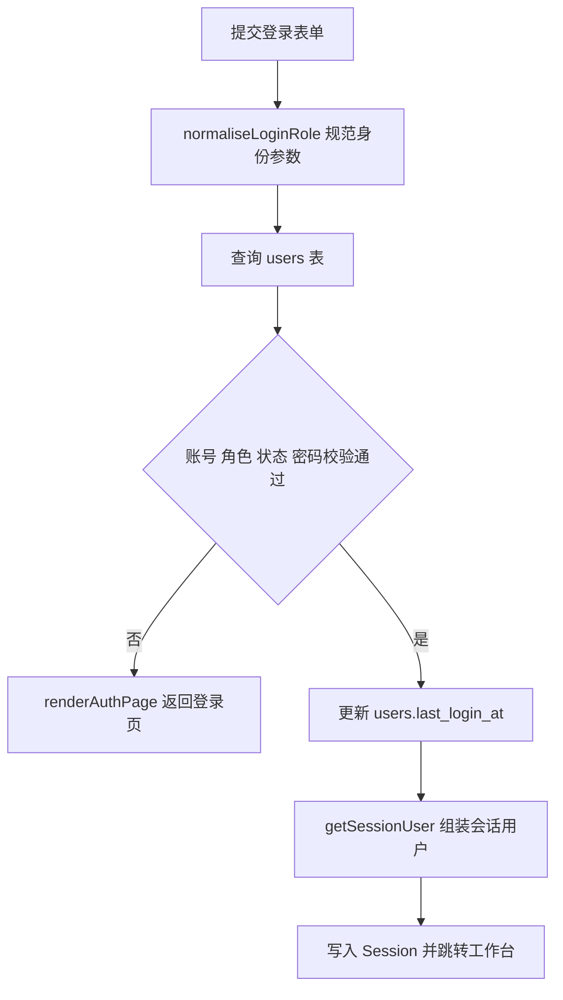

### 4.2 工作台

- 入口路由：`GET /dashboard`
- 关键函数：
  - `getStudentDashboard()`：统计学生当前学期课程数、已获学分、平均绩点和公告数据。
  - `getTeacherDashboard()`：统计教师当前学期开课数、学生覆盖数、成绩发布情况和最近教学任务。
  - `getAdminDashboard()`：统计系统账号、课程、选课和角色分布等全局运营数据。

- 关键业务规则：
  - 工作台按 `req.session.user.role` 动态分发
  - 学生工作台同时显示均分、平均绩点、加权 GPA
  - 教师工作台统计当前学期开课数、覆盖学生数、已发布/待处理成绩数
  - 管理员工作台统计账号总量、课程总量、开放选课数、有效选课数，并生成角色分布图

关键 SQL 示例：

```sql
SELECT
  COUNT(CASE WHEN enrollments.status = '已选' AND course_sections.term_id = ? THEN 1 END) AS current_course_count,
  ROUND(COALESCE(SUM(CASE WHEN grades.status = '已发布' AND grades.total_score >= 60 THEN courses.credits ELSE 0 END), 0), 1) AS earned_credits,
  ROUND(COALESCE(AVG(CASE WHEN grades.status = '已发布' THEN grades.grade_point END), 0), 1) AS average_gpa
FROM students
LEFT JOIN enrollments ON enrollments.student_id = students.id
LEFT JOIN course_sections ON course_sections.id = enrollments.section_id
LEFT JOIN courses ON courses.id = course_sections.course_id
LEFT JOIN grades ON grades.enrollment_id = enrollments.id
WHERE students.id = ?;
```

流程图：

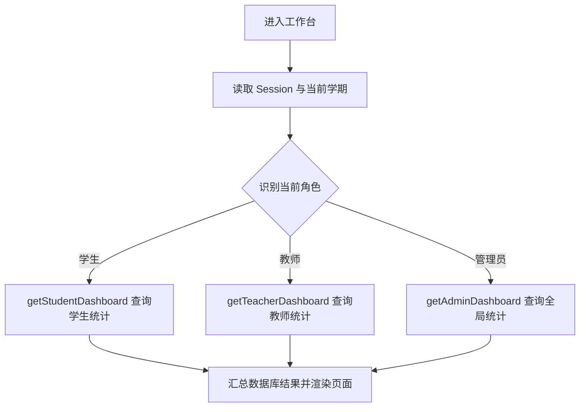

### 4.3 个人资料维护与密码修改

- 入口路由：`GET /profile`、`POST /profile`、`POST /profile/password`
- 关键函数：
  - `getProfileDetail()`：联查 `users` 与角色档案表，生成个人资料页展示所需的完整数据。
  - `withTransaction()`：把主表与角色档案表更新放进同一事务，避免只改成功一半。
  - `refreshSessionUser()`：资料修改后重新装配 Session，保证页头和侧边栏立即显示最新信息。

- 涉及表：`users`、`students`、`teachers`、`admins`
- 关键业务规则：
  - 所有角色都能修改 `full_name/email/phone`
  - 学生可修改 `gender/birth_date/address`
  - 教师可修改 `gender/birth_date/address/office_location/specialty_text`
  - 管理员可修改 `position`
  - 密码修改必须校验当前密码、两次新密码一致、长度至少 6 位

关键 SQL：

```sql
UPDATE users
SET full_name = ?, email = ?, phone = ?
WHERE id = ?;

UPDATE students
SET gender = ?, birth_date = ?, address = ?
WHERE id = ?;

UPDATE teachers
SET gender = ?, birth_date = ?, address = ?, office_location = ?, specialty_text = ?
WHERE id = ?;
```

流程图：

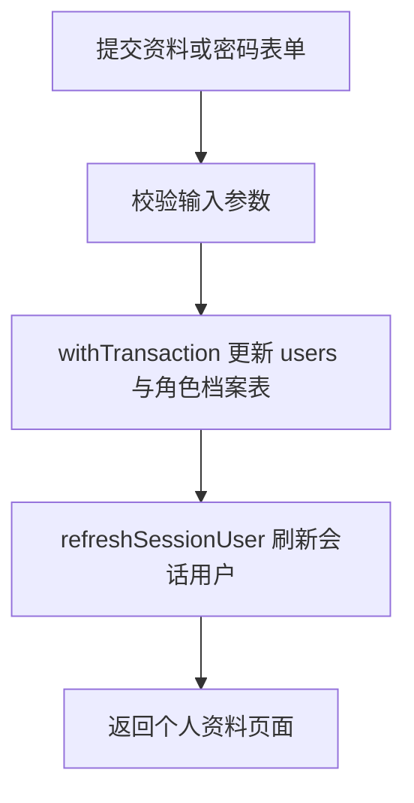

### 4.4 公告中心

- 入口路由：`GET /announcements`、`GET /announcements/:announcementId`
- 关键函数：
  - `buildAccessClause()`：按当前角色生成公告可见范围条件，限制学生只能看到自己有权限查看的公告。
  - `getPagination()`：解析页码和每页条数，得到数据库分页参数。
  - `buildPagination()`：根据总数生成分页栏结构，供模板直接渲染。

- 涉及表：`announcements`、`users`、`students`
- 关键业务规则：
  - 管理员可查看全部公告
  - 学生只能查看：
    - `target_role in ('all','student')`
    - 且 `target_student_id is null` 或等于自己
  - 教师/管理员端只接收非定向学生公告
  - 列表支持按关键字、优先级筛选，并按 `紧急 -> 重要 -> 普通` 排序

关键 SQL：

```sql
SELECT
  announcements.*,
  users.full_name AS publisher_name
FROM announcements
LEFT JOIN users ON users.id = announcements.published_by
WHERE announcements.target_role IN ('all', ?)
  AND (announcements.target_student_id IS NULL OR announcements.target_student_id = ?)
ORDER BY
  CASE announcements.priority
    WHEN '紧急' THEN 1
    WHEN '重要' THEN 2
    ELSE 3
  END,
  announcements.published_at DESC,
  announcements.id DESC
LIMIT ? OFFSET ?;
```

流程图：

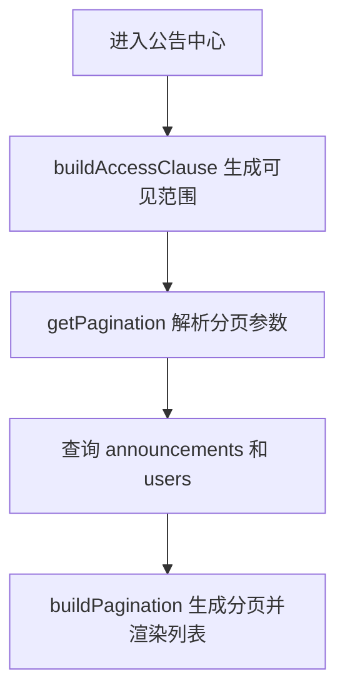

### 4.5 学生在线选课

- 入口路由：`GET /student/courses`、`POST /student/courses/:sectionId/select`
- 关键函数：
  - `getPassedCourseIds()`：查询学生已经通过的课程，用于过滤不可重复修读的课程。
  - `getRecommendedCourseIds()`：根据培养方案、当前开课和历史成绩计算推荐课程集合。
  - `getStudentSectionDetail()`：查询开课详情、已选人数和当前学生是否已选，供课程页与详情页复用。
  - `withTransaction()`：把选课记录写入和成绩初始化放进一个事务，保证选课成功后数据完整。

- 涉及表：`course_sections`、`courses`、`teachers`、`users`、`time_slots`、`terms`、`enrollments`、`grades`
- 关键业务规则：
  - 只展示当前学期且 `selection_status='开放选课'` 的开课
  - 推荐课程必须同时满足：在培养方案中应修、当前学期已开设且开放、尚未通过
  - 选课时必须检查当前学期、开课状态、容量与时间冲突
  - 若学生曾退过该课，则复用原 `enrollments` 记录，把状态改回 `已选`
  - 每次成功选课都要创建或重置一条 `grades` 为 `待录入`

关键 SQL：

```sql
SELECT id, status
FROM enrollments
WHERE section_id = ?
  AND student_id = ?
LIMIT 1;

INSERT INTO enrollments (section_id, student_id, status, selected_at)
VALUES (?, ?, '已选', NOW());

INSERT INTO grades (enrollment_id, status)
VALUES (?, '待录入')
ON DUPLICATE KEY UPDATE
  status = '待录入',
  usual_score = NULL,
  final_exam_score = NULL,
  total_score = NULL,
  grade_point = NULL,
  letter_grade = NULL;
```

流程图：

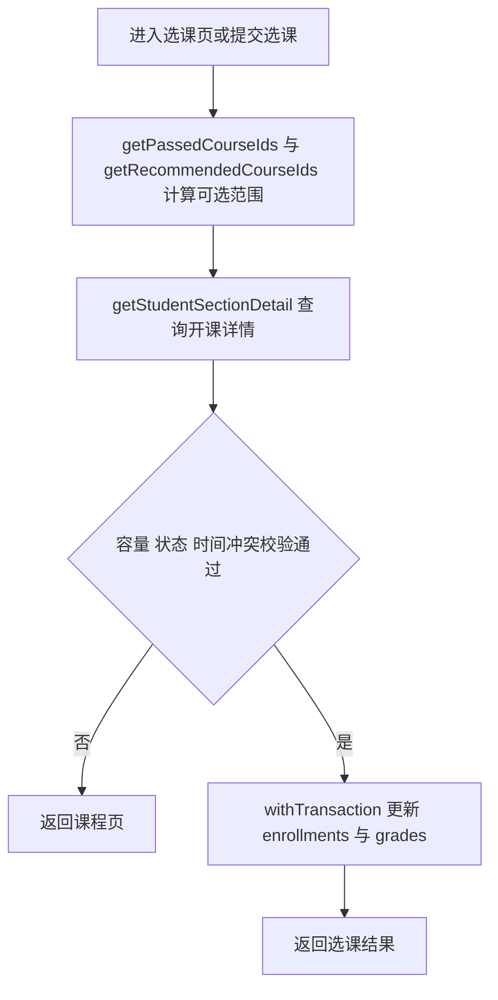

### 4.6 学生退课与“我的课程”

- 入口路由：`POST /student/enrollments/:enrollmentId/drop`、`GET /student/enrollments`

- 关键函数：
  - `getPagination()`：解析“我的课程”列表页的分页参数。
  - `buildPagination()`：生成“我的课程”分页栏展示数据。
  - `withTransaction()`：在退课时同时更新 `enrollments` 与 `grades`，确保课程状态与成绩状态一致。
- 关键业务规则：
  - 退课只允许针对当前学生自己的 `已选` 记录
  - 仅当前学期课程允许退课
  - 若成绩已发布且总评及格，则禁止退课
  - 退课不删除 `enrollments`，而是改为 `已退课`
  - 退课后把对应成绩清空并恢复为 `待录入`

关键 SQL：

```sql
UPDATE enrollments
SET status = '已退课',
    dropped_at = NOW()
WHERE id = ?;

UPDATE grades
SET usual_score = NULL,
    final_exam_score = NULL,
    total_score = NULL,
    grade_point = NULL,
    letter_grade = NULL,
    status = '待录入',
    teacher_comment = NULL
WHERE enrollment_id = ?;
```

流程图：

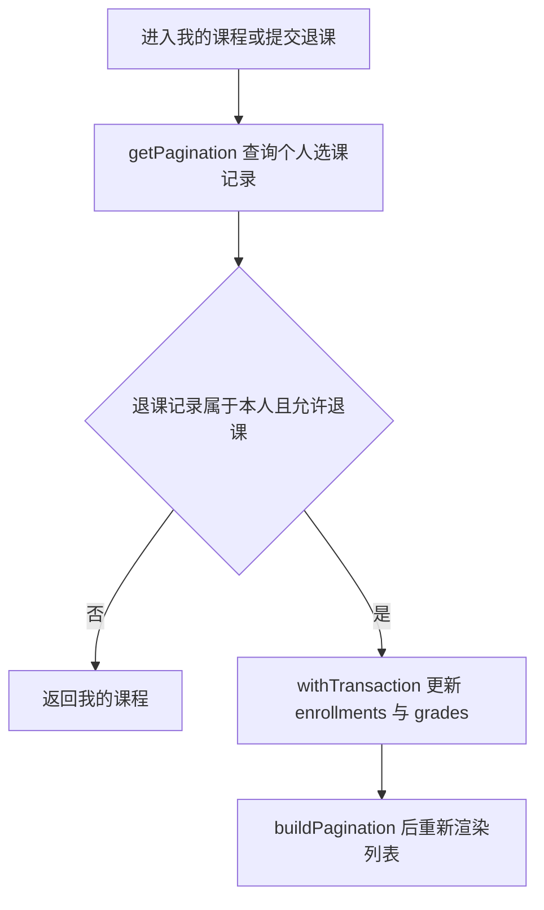

### 4.7 学生成绩查询

- 入口路由：`GET /student/grades`

- 关键函数：
  - `getPagination()`：解析成绩页筛选后的页码与页长。
  - `buildPagination()`：生成成绩列表的分页导航数据。
- 关键业务规则：
  - 只显示 `enrollments.status='已选'` 且 `grades.status='已发布'` 的成绩
  - 支持按学期、关键字、课程类型筛选
  - 汇总区展示平均分、平均绩点、加权 GPA、已获学分、预警门数

关键 SQL：

```sql
SELECT
  courses.course_code,
  courses.course_name,
  courses.course_type,
  courses.credits,
  course_sections.section_code,
  terms.name AS term_name,
  users.full_name AS teacher_name,
  grades.usual_score,
  grades.final_exam_score,
  grades.total_score,
  grades.grade_point
FROM enrollments
INNER JOIN course_sections ON course_sections.id = enrollments.section_id
INNER JOIN courses ON courses.id = course_sections.course_id
INNER JOIN terms ON terms.id = course_sections.term_id
INNER JOIN teachers ON teachers.id = course_sections.teacher_id
INNER JOIN users ON users.id = teachers.user_id
INNER JOIN grades ON grades.enrollment_id = enrollments.id
WHERE enrollments.student_id = ?
  AND enrollments.status = '已选'
  AND grades.status = '已发布'
ORDER BY terms.start_date DESC, courses.course_code ASC
LIMIT ? OFFSET ?;
```

流程图：

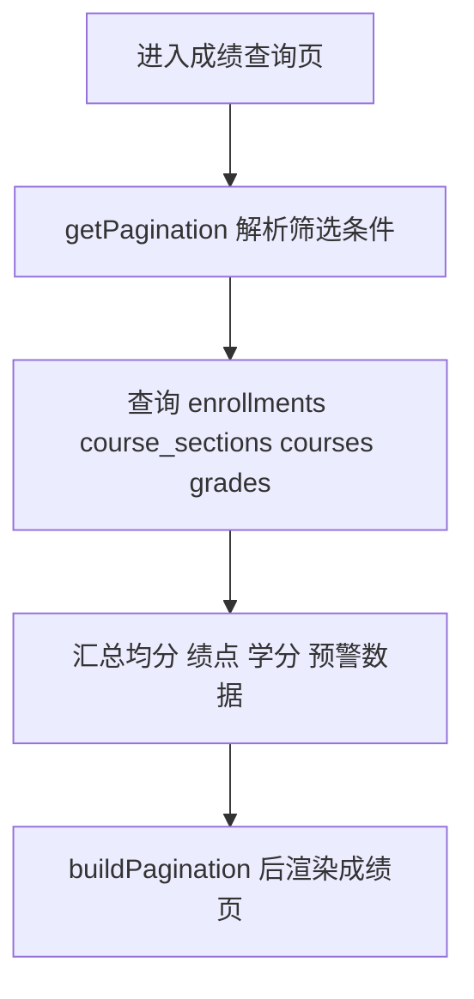

### 4.8 学生课表与全校课表

- 入口路由：
  - `GET /student/schedule`
  - `GET /student/campus-schedule`
  - `GET /student/campus-schedule/:sectionId`
  - `GET /student/sections/:sectionId`
- 关键函数：
  - `buildScheduleGrid()`：把开课记录转换成按星期和节次展开的二维课表网格。
  - `getStudentSectionDetail()`：查询单门开课的教师、教室、时间段和已选状态，供详情页复用。

- 关键业务规则：
  - “我的课表”只展示当前学期本人 `已选` 课程
  - “全校课表查询”只展示当前学期且未归档开课
  - 单课详情页会把一门课单独渲染为课表块，便于看时段和教室

关键 SQL：

```sql
SELECT
  courses.course_name,
  courses.course_type,
  course_sections.section_code,
  users.full_name AS teacher_name,
  classrooms.building_name,
  classrooms.room_number,
  time_slots.weekday,
  time_slots.start_period,
  time_slots.end_period,
  time_slots.label
FROM enrollments
INNER JOIN course_sections ON course_sections.id = enrollments.section_id
INNER JOIN courses ON courses.id = course_sections.course_id
INNER JOIN teachers ON teachers.id = course_sections.teacher_id
INNER JOIN users ON users.id = teachers.user_id
INNER JOIN classrooms ON classrooms.id = course_sections.classroom_id
INNER JOIN time_slots ON time_slots.id = course_sections.time_slot_id
WHERE enrollments.student_id = ?
  AND enrollments.status = '已选'
  AND course_sections.term_id = ?
ORDER BY time_slots.weekday ASC, time_slots.start_period ASC;
```

流程图：

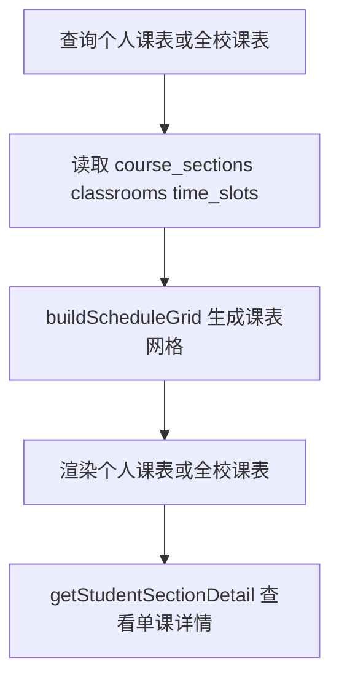

### 4.9 学生培养方案与推荐课程

- 入口路由：`GET /student/program-plan`
- 关键函数：
  - `getStudentProgramProfile()`：读取学生所在班级、专业、院系与培养方案基本信息。
  - `getStudentCourseProgress()`：汇总学生历史通过、挂科和当前已选课进度。
  - `buildCourseStatus()`：把课程进度转换成“通过、未通过、已选课、未修读”等展示状态。
  - `getTrainingPlanDetail()`：聚合培养方案、模块、课程和学分汇总结构。
  - `getStudentTrainingPlan()`：面向学生端组装完整培养方案视图数据。
  - `getRecommendedCourseIds()`：计算当前学期可推荐的课程编号集合。
  - `syncTrainingPlanCredits()`：同步模块学分和方案总学分，保证页面展示与数据库一致。

- 涉及表：`students`、`classes`、`majors`、`departments`、`training_plans`、`training_plan_modules`、`training_plan_courses`、`courses`、`enrollments`、`course_sections`、`grades`、`terms`
- 关键业务规则：
  - 培养方案按专业绑定，一个专业至多一个方案
  - 页面展示不是静态文本，而是实时根据学生历史成绩、当前选课状态和培养方案映射计算
  - 课程状态判定规则：
    - 有已发布且及格成绩：`通过`
    - 无通过但存在历史挂科：`未通过`
    - 当前学期已选且尚未发布：`已选课`
    - 其他：`未修读`
  - 模块学分、方案总学分、学生 `credits_required` 会在方案维护后自动同步
  - 推荐课程只推荐当前学期已经开设的课程

关键 SQL：

```sql
UPDATE training_plan_modules
LEFT JOIN (
  SELECT
    training_plan_courses.module_id,
    ROUND(COALESCE(SUM(courses.credits), 0), 1) AS total_credits
  FROM training_plan_courses
  INNER JOIN courses ON courses.id = training_plan_courses.course_id
  WHERE training_plan_courses.training_plan_id = ?
  GROUP BY training_plan_courses.module_id
) AS stats ON stats.module_id = training_plan_modules.id
SET training_plan_modules.required_credits = COALESCE(stats.total_credits, 0)
WHERE training_plan_modules.training_plan_id = ?;
```

流程图：

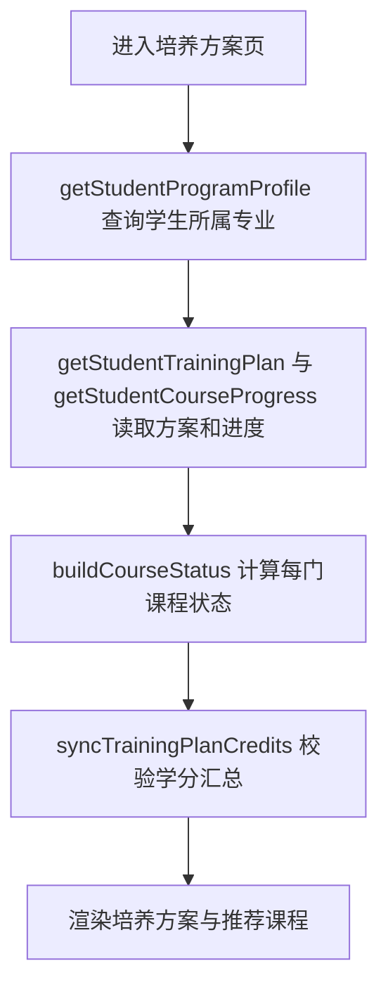

### 4.10 学生教学评价

- 入口路由：`GET /student/evaluations`、`POST /student/evaluations/:enrollmentId`
- 关键函数：
  - `getPagination()`：解析教学评价列表分页参数。
  - `buildPagination()`：生成教学评价分页栏数据。
  - `initStudentEvaluationModal()`：前端负责把课程、教师、评分和原评价内容装入弹窗，统一评价交互入口。

- 涉及表：`enrollments`、`course_sections`、`courses`、`teachers`、`users`、`grades`、`teaching_evaluations`
- 关键业务规则：
  - 一个选课记录最多一条评价，靠 `teaching_evaluations.enrollment_id UNIQUE` 保证
  - 当前学期未发布成绩的课程不能评价
  - 历史学期课程即使当前没有成绩页也可以评价
  - 评价提交使用 `INSERT ... ON DUPLICATE KEY UPDATE`，因此支持修改

关键 SQL：

```sql
INSERT INTO teaching_evaluations (
  enrollment_id,
  section_id,
  student_id,
  teacher_id,
  rating,
  content
)
VALUES (?, ?, ?, ?, ?, ?)
ON DUPLICATE KEY UPDATE
  rating = VALUES(rating),
  content = VALUES(content),
  updated_at = NOW();
```

流程图：

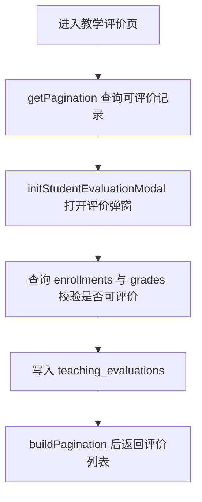

### 4.11 学习画像

- 入口路由：`GET /student/learning-profile`
- 关键函数：
  - `getLearningProfile(studentId, requestedTermId, requestedMode)`：按学期和统计模式读取已发布成绩，生成汇总指标和雷达图数据。

- 涉及表：`enrollments`、`course_sections`、`courses`、`terms`、`grades`
- 关键业务规则：
  - 只统计已发布成绩
  - 支持按学期切换
  - 支持两种模式：`gpa` 与 `score`
  - 输出同时用于顶部汇总和雷达图

关键 SQL：

```sql
SELECT DISTINCT
  terms.id,
  terms.name,
  terms.start_date
FROM enrollments
INNER JOIN course_sections ON course_sections.id = enrollments.section_id
INNER JOIN terms ON terms.id = course_sections.term_id
INNER JOIN grades ON grades.enrollment_id = enrollments.id
WHERE enrollments.student_id = ?
  AND enrollments.status = '已选'
  AND grades.status = '已发布'
ORDER BY terms.start_date DESC;
```

流程图：

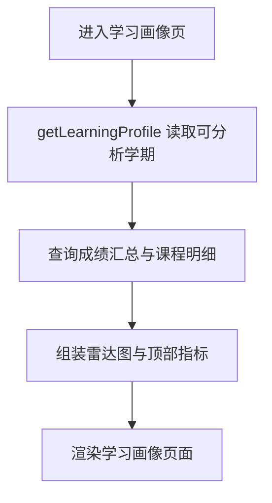

### 4.12 教师教学任务与成绩册

- 入口路由：`GET /teacher/sections`、`GET /teacher/sections/:sectionId`
- 关键函数：
  - `getPagination()`：解析教学任务列表和成绩册名单分页参数。
  - `buildPagination()`：生成教学任务列表与成绩册分页结构。
  - `buildScheduleGrid()`：把教师开课记录转换成课表网格，在成绩册详情页同步展示上课时间。

- 涉及表：`course_sections`、`courses`、`terms`、`classrooms`、`time_slots`、`enrollments`、`students`、`classes`、`users`、`grades`、`teaching_evaluations`
- 关键业务规则：
  - 只能查看自己担任教师的开课
  - 成绩册详情页同时展示开课基础信息、班级成绩册、已发布/待录入统计、平均分和最近评价

关键 SQL：

```sql
SELECT
  enrollments.id AS enrollment_id,
  students.student_no,
  users.full_name AS student_name,
  classes.class_name,
  grades.usual_score,
  grades.final_exam_score,
  grades.total_score,
  grades.grade_point
FROM enrollments
INNER JOIN students ON students.id = enrollments.student_id
INNER JOIN users ON users.id = students.user_id
INNER JOIN classes ON classes.id = students.class_id
LEFT JOIN grades ON grades.enrollment_id = enrollments.id
WHERE enrollments.section_id = ?
  AND enrollments.status = '已选'
ORDER BY students.student_no ASC
LIMIT ? OFFSET ?;
```

流程图：

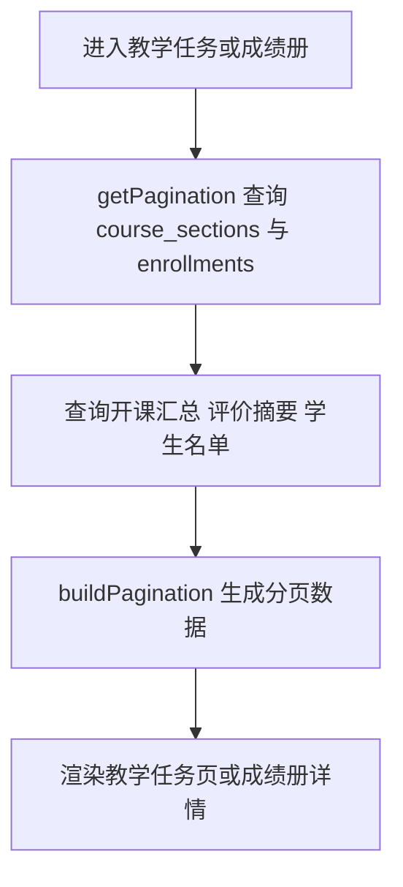

### 4.13 教师修改成绩占比

- 入口路由：`POST /teacher/sections/:sectionId/weights`
- 关键函数：
  - `withTransaction()`：把开课权重修改和批量成绩重算放进同一事务提交。
  - `recalculateSectionGrades(connection, sectionId, usualWeight, finalWeight)`：按新权重重算该开课下所有已选学生的总评、等级和绩点。

- 涉及表：`course_sections`、`enrollments`、`grades`
- 关键业务规则：
  - 平时占比 + 期末占比必须等于 100
  - 只能修改自己负责的开课
  - 修改后必须批量重算该门课所有已选学生的总评、等级、绩点

关键 SQL：

```sql
UPDATE course_sections
SET usual_weight = ?, final_weight = ?
WHERE id = ?;

UPDATE grades
SET total_score = ?,
    grade_point = ?,
    letter_grade = ?
WHERE id = ?;
```

流程图：

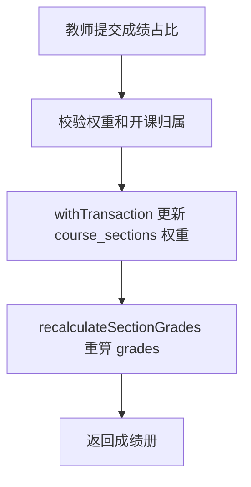

### 4.14 教师录入成绩与自动保存

- 入口路由：`POST /teacher/enrollments/:enrollmentId/grade`
- 关键函数：
  - `saveAjaxGradeForm()`：前端发送单行成绩保存请求，并在保存成功后回填总评和绩点。
  - `initAjaxGradeForms()`：前端注册自动保存、手动保存和批量保存事件。
  - `parseOptionalScore()`：把空输入和非法输入转换为后端可处理的分数值。
  - `calculateTotalScore()`：根据平时分、期末分和开课权重计算总评、等级和绩点。

- 涉及表：`enrollments`、`course_sections`、`courses`、`grades`
- 关键业务规则：
  - 平时分、期末分范围必须在 `0~100`
  - 只有当前教师负责且学生仍为 `已选` 的记录可录入成绩
  - 录入后成绩状态始终回到 `待录入`
  - 前端支持单行保存、自动保存、批量保存

关键 SQL：

```sql
INSERT INTO grades (
  enrollment_id,
  usual_score,
  final_exam_score,
  total_score,
  grade_point,
  letter_grade,
  status,
  teacher_comment
)
VALUES (?, ?, ?, ?, ?, ?, '待录入', NULL)
ON DUPLICATE KEY UPDATE
  usual_score = VALUES(usual_score),
  final_exam_score = VALUES(final_exam_score),
  total_score = VALUES(total_score),
  grade_point = VALUES(grade_point),
  letter_grade = VALUES(letter_grade),
  status = '待录入',
  teacher_comment = NULL;
```

流程图：

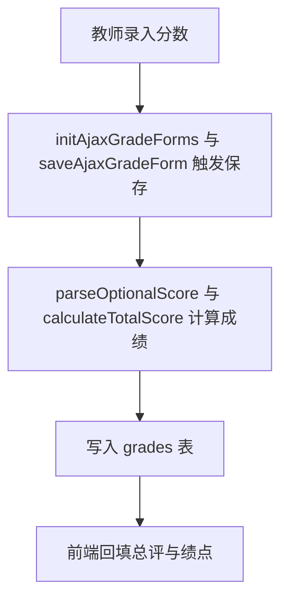

### 4.15 教师发布成绩

- 入口路由：`POST /teacher/sections/:sectionId/publish`

- 关键函数：
  - `getSafeTeacherReturnPath()`：规范发布后返回地址，确保教师只能跳回自己的业务页面。
- 涉及表：`course_sections`、`courses`、`enrollments`、`grades`
- 关键业务规则：
  - 只能发布自己的开课成绩
  - 没有学生或没有可发布总评时不执行更新
  - 只把 `grades.total_score IS NOT NULL` 的记录改为 `已发布`

关键 SQL：

```sql
UPDATE grades
INNER JOIN enrollments ON enrollments.id = grades.enrollment_id
SET grades.status = '已发布'
WHERE enrollments.section_id = ?
  AND enrollments.status = '已选'
  AND grades.total_score IS NOT NULL;
```

流程图：

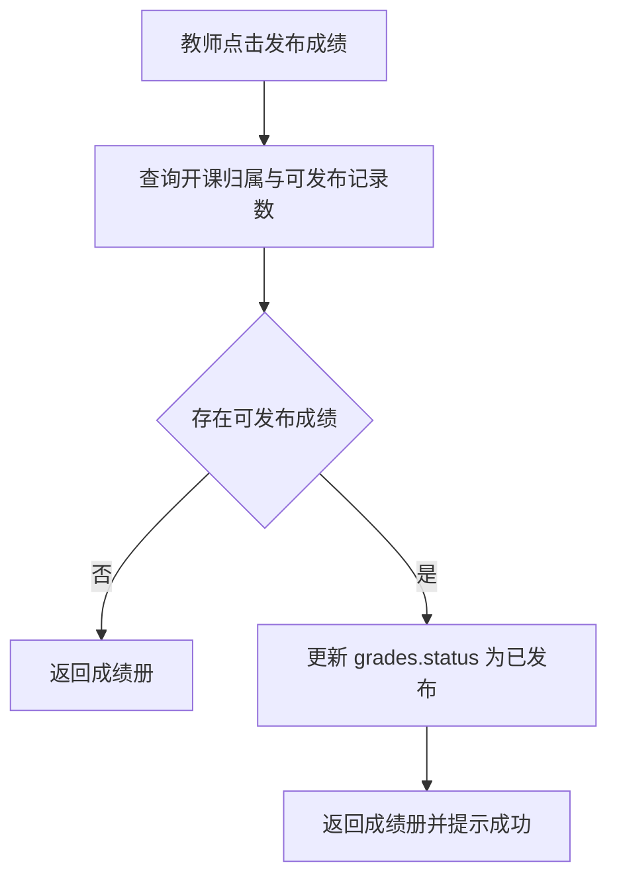

### 4.16 教师评价反馈与教师课表

- 入口路由：`GET /teacher/evaluations`、`GET /teacher/schedule`
- 关键函数：
  - `getPagination()`：解析评价反馈列表的分页和筛选参数。
  - `buildPagination()`：生成评价反馈列表分页结构。
  - `buildScheduleGrid()`：把教师当前学期开课转换成可视化课表网格。

- 涉及表：`teaching_evaluations`、`students`、`users`、`course_sections`、`courses`、`classrooms`、`time_slots`
- 关键业务规则：
  - 教师评价列表只显示自己的被评价记录
  - 支持按课程/学生/开课号关键字筛选，支持按 section_id 精确筛选
  - 教师课表只显示当前学期自己承担的开课

流程图：

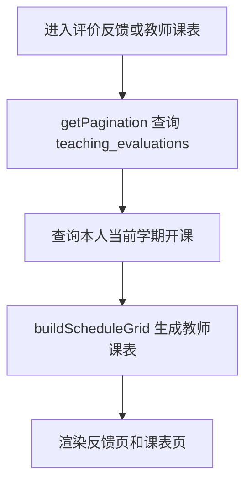

### 4.17 管理端账号管理

- 入口路由：`GET /admin/users`、`POST /admin/users/:userId/status`、`POST /admin/users/:userId/reset-password`
- 关键函数：
  - `getPagination()`：解析账号列表页码和页长。
  - `buildPagination()`：生成账号列表分页栏结构。
  - `getSafeReturnPath()`：校验后台返回地址，避免表单提交后跳转到非法路径。
  - `hashDefaultPassword()`：按角色生成默认密码哈希，用于重置密码。

- 涉及表：`users`、`students`、`teachers`、`admins`
- 关键业务规则：
  - 账号列表以 `users` 为主表，再按角色左连接档案表显示学号、工号、管理员编号
  - 状态修改只更新 `users.status`，不会删除档案
  - 密码重置按角色回写默认密码哈希：学生 `student123`、教师 `teacher123`、管理员 `admin123`
  - AJAX 弹窗提交时通过重写 `res.redirect` 返回 `X-Redirect-To`，前端可在模态框内完成后跳转刷新

关键 SQL：

```sql
SELECT
  users.*,
  students.student_no,
  teachers.teacher_no,
  teachers.title,
  admins.admin_no,
  admins.position
FROM users
LEFT JOIN students ON students.user_id = users.id
LEFT JOIN teachers ON teachers.user_id = users.id
LEFT JOIN admins ON admins.user_id = users.id
WHERE ${whereClause}
ORDER BY users.role ASC, users.id ASC
LIMIT ? OFFSET ?;

UPDATE users SET status = ? WHERE id = ?;

UPDATE users SET password_hash = ? WHERE id = ?;
```

流程图：

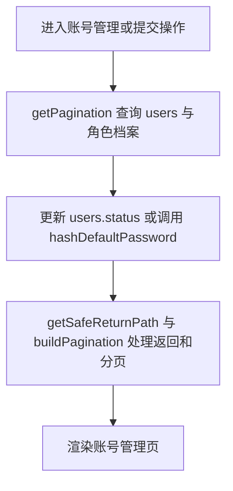

### 4.18 管理端编号预览

- 入口路由：`GET /admin/preview/student-number`、`GET /admin/preview/teacher-no`、`GET /admin/preview/course-code`、`GET /admin/preview/section-code`
- 前端函数：`public/js/app.js` 中编号预览相关 `fetch()` 调用逻辑
- 关键函数：
  - `resolveStudentNumber()`：根据班级、入学年份和班内序号预生成学号。
  - `resolveTeacherNo()`：根据院系和年份预生成教师工号。
  - `resolveCourseCode()`：根据专业和课程类型预生成课程号。
  - `resolveSectionCode()`：根据学期和课程预生成开课号。
  - `buildStudentNo()`：按院系号、年份、班号和序号拼接最终学号字符串。

- 涉及表：`classes`、`majors`、`departments`、`students`、`teachers`、`courses`、`course_sections`
- 关键业务规则：
  - 学号按“院系号 + 入学年份后两位 + 班号 + 班内流水号”生成
  - 工号按 `T + department_no + 当前年份后两位 + 两位流水号` 生成
  - 课程号按 `major.code + R/E + 三位流水号` 生成，必修为 `R`，选修为 `E`
  - 开课号按 `T{termId两位}-{course_code}-{两位流水号}` 生成
  - 预览只返回 JSON，不直接落库，真正新增时仍会再次按同样规则在事务中重新计算

关键 SQL：

```sql
SELECT
  classes.id,
  classes.class_code,
  classes.grade_year,
  majors.id AS major_id,
  departments.department_no
FROM classes
INNER JOIN majors ON majors.id = classes.major_id
INNER JOIN departments ON departments.id = majors.department_id
WHERE classes.id = ?
LIMIT 1;

SELECT COALESCE(MAX(CAST(class_serial AS UNSIGNED)), 0) AS max_serial
FROM students
WHERE class_id = ?
  AND id <> ?;

SELECT COALESCE(MAX(CAST(SUBSTRING(teacher_no, ?) AS UNSIGNED)), 0) AS max_serial
FROM teachers
WHERE teacher_no LIKE ?;
```

流程图：

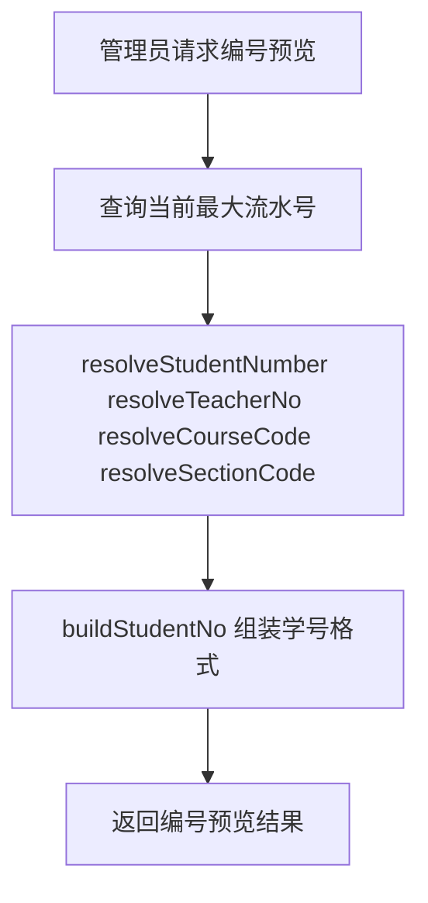

### 4.19 管理端学生档案管理

- 入口路由：`GET /admin/students`、`GET /admin/students/new`、`GET /admin/students/:studentId/edit`、`POST /admin/students`、`PUT /admin/students/:studentId`、`DELETE /admin/students/:studentId`
- 关键函数：
  - `resolveStudentNumber()`：为新增学生计算班内序号和学号。
  - `resolveAdmissionTermId()`：按入学年份反查对应入学学期。
  - `getCreditsRequiredForClass()`：按班级所属专业计算学生应修总学分。
  - `hashDefaultPassword()`：生成学生默认密码哈希。
  - `summarizeDependencies()`：把删除依赖统计整理成人类可读的阻断原因。

- 涉及表：`users`、`students`、`classes`、`majors`、`departments`、`terms`、`enrollments`、`teaching_evaluations`、`academic_warnings`、`announcements`
- 关键业务规则：
  - 新建学生必须同时创建 `users` 与 `students` 两条记录，并放入同一事务
  - 学生默认状态为启用、默认密码为 `student123`、默认头像色取学生角色配色
  - `entry_year` 从班级 `grade_year` 推导，`admission_term_id` 通过 `YEAR(start_date)=entry_year` 查最早学期
  - `credits_required` 不手填，而是根据班级所属专业当前培养方案自动计算；若无方案则回退为 `160`
  - 编辑学生时当前代码只允许修改所属班级，并同步更新 `credits_required`
  - 删除学生前会显式检查选课、评价、预警、定向公告，避免直接触发外键错误

关键 SQL：

```sql
INSERT INTO users (username, password_hash, role, full_name, email, phone, avatar_color, status)
VALUES (?, ?, 'student', ?, ?, ?, ?, ?);

INSERT INTO students (
  user_id,
  student_no,
  gender,
  class_id,
  class_serial,
  entry_year,
  admission_term_id,
  birth_date,
  address,
  credits_required
)
VALUES (?, ?, ?, ?, ?, ?, ?, ?, ?, ?);

UPDATE students
SET class_id = ?, credits_required = ?
WHERE id = ?;
```

流程图：

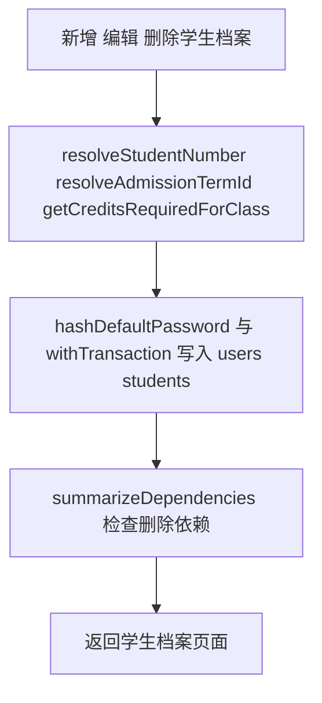

### 4.20 管理端学业详情与学业预警

- 入口路由：`GET /admin/students/:studentId/academics`、`POST /admin/students/:studentId/warnings`
- 关键函数：
  - `getOutstandingRequiredCourses()`：找出学生尚未通过的必修课和挂科次数。
  - `withTransaction()`：把公告写入和学业预警写入放进同一事务。
  - `getSafeReturnPath()`：规范学业详情和预警提交后的返回路径。

- 涉及表：`students`、`users`、`classes`、`majors`、`enrollments`、`course_sections`、`courses`、`terms`、`grades`、`academic_warnings`、`announcements`、`admins`
- 关键业务规则：
  - 学业详情页会同时显示学生基本信息、历史选课记录、预警历史、当前仍未通过的必修课清单
  - “未通过必修课”判定逻辑不是简单看一次成绩，而是查同一课程是否存在已发布且 `>=60` 的通过记录；若从未通过，则累计失败次数
  - 当前学期预警阈值固定为 `outstandingCourses.length > 5`
  - 同一学生同一学期只能有一条 `academic_warnings`
  - 发送预警时会在事务内同时插入一条定向 `announcements` 和一条 `academic_warnings`，二者通过 `announcement_id` 关联

关键 SQL：

```sql
SELECT
  courses.id,
  courses.course_code,
  courses.course_name,
  COUNT(*) AS failed_attempts,
  MAX(terms.start_date) AS latest_term_start
FROM enrollments
INNER JOIN course_sections ON course_sections.id = enrollments.section_id
INNER JOIN courses ON courses.id = course_sections.course_id
INNER JOIN grades ON grades.enrollment_id = enrollments.id
INNER JOIN terms ON terms.id = course_sections.term_id
WHERE enrollments.student_id = ?
  AND enrollments.status = '已选'
  AND courses.course_type = '必修'
  AND grades.status = '已发布'
  AND grades.total_score < 60
  AND NOT EXISTS (
    SELECT 1
    FROM enrollments AS pass_enrollments
    INNER JOIN course_sections AS pass_sections ON pass_sections.id = pass_enrollments.section_id
    INNER JOIN grades AS pass_grades ON pass_grades.enrollment_id = pass_enrollments.id
    WHERE pass_enrollments.student_id = enrollments.student_id
      AND pass_enrollments.status = '已选'
      AND pass_sections.course_id = courses.id
      AND pass_grades.status = '已发布'
      AND pass_grades.total_score >= 60
  )
GROUP BY courses.id;

INSERT INTO announcements (
  title, content, category, target_role, target_student_id, priority, published_by, published_at
)
VALUES (?, ?, ?, 'student', ?, ?, ?, NOW());

INSERT INTO academic_warnings (
  student_id, term_id, issued_by, announcement_id, required_failed_count, content
)
VALUES (?, ?, ?, ?, ?, ?);
```

流程图：

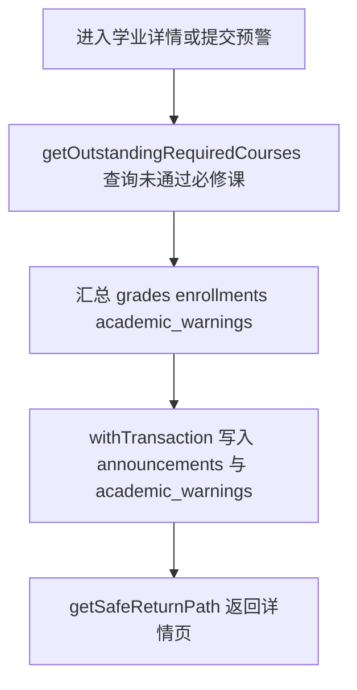

### 4.21 管理端教师管理

- 入口路由：`GET /admin/teachers`、`GET /admin/teachers/new`、`GET /admin/teachers/:teacherId/edit`、`POST /admin/teachers`、`PUT /admin/teachers/:teacherId`、`DELETE /admin/teachers/:teacherId`
- 关键函数：
  - `resolveTeacherNo()`：根据院系编号和年份生成教师工号。
  - `hashDefaultPassword()`：生成教师默认密码哈希。
  - `summarizeDependencies()`：把开课和评价等删除依赖整理成提示信息。

- 涉及表：`users`、`teachers`、`departments`、`course_sections`、`teaching_evaluations`
- 关键业务规则：
  - 新建教师同样采用“账号表 + 档案表”双表事务写入
  - 工号按院系编号与当前年份自动生成，不由管理员手工输入
  - 编辑教师时允许修改用户名、姓名、院系、职称、办公地点
  - 删除教师前必须确认不存在开课记录与教学评价

关键 SQL：

```sql
INSERT INTO users (username, password_hash, role, full_name, email, phone, avatar_color, status)
VALUES (?, ?, 'teacher', ?, ?, ?, ?, ?);

INSERT INTO teachers (
  user_id, teacher_no, gender, birth_date, address, department_id, title, office_location, specialty_text
)
VALUES (?, ?, ?, ?, ?, ?, ?, ?, ?);

DELETE FROM teachers WHERE id = ?;
DELETE FROM users WHERE id = ?;
```

流程图：

```mermaid
flowchart TD
  A[新增 编辑 删除教师] --> B[resolveTeacherNo 生成工号]
  B --> C[hashDefaultPassword 与 withTransaction 写入 users teachers]
  C --> D[summarizeDependencies 检查开课和评价依赖]
  D --> E[返回教师管理页]
```

### 4.22 管理端课程管理

- 入口路由：`GET /admin/courses`、`GET /admin/courses/new`、`GET /admin/courses/:courseId/edit`、`POST /admin/courses`、`PUT /admin/courses/:courseId`、`DELETE /admin/courses/:courseId`
- 关键函数：
  - `getMajorByDepartment()`：校验所选专业是否确实属于当前院系。
  - `resolveCourseCode()`：按专业和课程类型生成课程号。
  - `syncTrainingPlanCreditsByCourse()`：课程学分变更后，联动刷新所有相关培养方案的学分统计。

- 涉及表：`courses`、`departments`、`majors`、`training_plan_courses`、`course_sections`
- 关键业务规则：
  - 新增和编辑课程前必须校验专业属于所选院系，避免 `major_id` 与 `department_id` 不一致
  - 课程号自动生成，区分必修/选修编号前缀
  - 更新课程学分后，需要联动调用 `syncTrainingPlanCreditsByCourse()`，把所有引用该课程的培养方案总学分和模块学分重新汇总
  - 删除课程前必须检查是否已经被开课或纳入培养方案

关键 SQL：

```sql
INSERT INTO courses (
  department_id, major_id, course_code, course_name, course_type,
  credits, total_hours, assessment_method, description
)
VALUES (?, ?, ?, ?, ?, ?, ?, ?, ?);

UPDATE courses
SET department_id = ?,
    major_id = ?,
    course_name = ?,
    course_type = ?,
    credits = ?,
    total_hours = ?,
    assessment_method = ?,
    description = ?
WHERE id = ?;

DELETE FROM courses WHERE id = ?;
```

流程图：

```mermaid
flowchart TD
  A[新增 编辑 删除课程] --> B[getMajorByDepartment 校验专业归属]
  B --> C[resolveCourseCode 写入或更新 courses]
  C --> D[syncTrainingPlanCreditsByCourse 同步培养方案学分]
  D --> E[返回课程管理页]
```

### 4.23 管理端开课管理

- 入口路由：`GET /admin/sections`、`GET /admin/sections/new`、`GET /admin/sections/:sectionId/edit`、`POST /admin/sections`、`PUT /admin/sections/:sectionId`、`DELETE /admin/sections/:sectionId`
- 关键函数：
  - `getSectionSelectableTerms()`：读取允许开课的学期选项。
  - `isSectionSelectableTerm()`：校验开课学期是否为当前学期或规划中学期。
  - `ensureSectionConflict()`：检查同学期同时间段下的教师冲突和教室冲突。
  - `resolveSectionCode()`：按学期和课程自动生成开课号。
  - `recalculateSectionGrades()`：开课权重变更后批量重算已有成绩。
  - `getSectionDeleteSummary()`：删除开课前汇总选课、成绩、评价等依赖数据。

- 涉及表：`course_sections`、`courses`、`teachers`、`users`、`terms`、`classrooms`、`time_slots`、`enrollments`、`grades`、`teaching_evaluations`
- 关键业务规则：
  - 开课学期只能选择当前学期或 `规划中` 学期
  - `usual_weight + final_weight` 必须等于 `100`
  - 同一学期同一时段下，教师和教室都不能冲突；该规则由显式查询和唯一约束双重保证
  - 已归档开课不能编辑、不能删除
  - 修改权重或成绩结构后，会调用 `recalculateSectionGrades()` 重算本开课下全部已有成绩
  - 删除开课前必须确认不存在选课、成绩、教学评价

关键 SQL：

```sql
SELECT
  section_code,
  CASE
    WHEN teacher_id = ? THEN 'teacher'
    WHEN classroom_id = ? THEN 'classroom'
  END AS conflict_type
FROM course_sections
WHERE term_id = ?
  AND time_slot_id = ?
  AND id <> ?
  AND (teacher_id = ? OR classroom_id = ?)
LIMIT 1;

INSERT INTO course_sections (
  course_id, teacher_id, term_id, classroom_id, time_slot_id, section_code,
  weeks_text, capacity, selection_status, usual_weight, final_weight, notes
)
VALUES (?, ?, ?, ?, ?, ?, ?, ?, ?, ?, ?, ?);

UPDATE course_sections
SET course_id = ?, teacher_id = ?, term_id = ?, classroom_id = ?, time_slot_id = ?,
    weeks_text = ?, capacity = ?, selection_status = ?, usual_weight = ?, final_weight = ?, notes = ?
WHERE id = ?;
```

流程图：

```mermaid
flowchart TD
  A[新增 编辑 删除开课] --> B[getSectionSelectableTerms 与 isSectionSelectableTerm 校验学期]
  B --> C[ensureSectionConflict 检查教师和教室冲突]
  C --> D[resolveSectionCode 写入 course_sections]
  D --> E[recalculateSectionGrades 或 getSectionDeleteSummary 处理重算与删除]
  E --> F[返回开课管理页]
```

### 4.24 管理端学期管理

- 入口路由：`GET /admin/terms`、`GET /admin/terms/new`、`GET /admin/terms/:termId/edit`、`POST /admin/terms`、`PUT /admin/terms/:termId`、`DELETE /admin/terms/:termId`
- 关键函数：
  - `normalizeTermPayload()`：把学期表单标准化为统一字段结构。
  - `validateTermPayload()`：校验教学周期、选课时间和当前学期状态是否合法。
  - `withTransaction()`：在切换当前学期和保存学期数据时保证整体提交一致。

- 涉及表：`terms`、`course_sections`、`students`、`academic_warnings`
- 关键业务规则：
  - 学期名称、学年 + 学期标签都必须唯一
  - 学期的教学时间范围与选课窗口先经过 `validateTermPayload()` 校验，再交由数据库 `CHECK` 约束二次兜底
  - 若本次新增/编辑设置 `is_current = 1`，系统会先把其他学期全部清零，保证任意时刻只有一个当前学期
  - 删除学期前必须保证没有开课、没有学生入学学期引用、没有学业预警引用

关键 SQL：

```sql
UPDATE terms SET is_current = 0;

INSERT INTO terms (
  name, academic_year, semester_label,
  start_date, end_date, selection_start, selection_end,
  is_current, status
)
VALUES (?, ?, ?, ?, ?, ?, ?, ?, ?);

UPDATE terms
SET name = ?, academic_year = ?, semester_label = ?,
    start_date = ?, end_date = ?, selection_start = ?, selection_end = ?,
    is_current = ?, status = ?
WHERE id = ?;
```

流程图：

```mermaid
flowchart TD
  A[新增 编辑 删除学期] --> B[normalizeTermPayload 规范表单]
  B --> C[validateTermPayload 校验日期与状态]
  C --> D[withTransaction 更新 terms 表]
  D --> E[删除时统计引用后返回]
```

### 4.25 管理端教室管理

- 入口路由：`GET /admin/classrooms`、`GET /admin/classrooms/new`、`GET /admin/classrooms/:classroomId/edit`、`POST /admin/classrooms`、`PUT /admin/classrooms/:classroomId`、`DELETE /admin/classrooms/:classroomId`
- 关键函数：
  - `getPagination()`：解析教室列表分页参数。
  - `buildPagination()`：生成教室列表分页数据。
  - `getCount()`：统计教室被开课引用的次数，用于删除校验。

- 涉及表：`classrooms`、`course_sections`
- 关键业务规则：
  - 教室列表支持按楼栋、房型、关键字筛选，并统计每个教室已关联的开课数量
  - `(building_name, room_number)` 由唯一约束保证不能重复
  - 删除教室前必须确保没有任何开课引用

关键 SQL：

```sql
SELECT
  classrooms.*,
  COUNT(DISTINCT course_sections.id) AS section_count
FROM classrooms
LEFT JOIN course_sections ON course_sections.classroom_id = classrooms.id
WHERE ${whereClause}
GROUP BY classrooms.id
ORDER BY classrooms.building_name ASC, classrooms.room_number ASC
LIMIT ? OFFSET ?;

INSERT INTO classrooms (building_name, room_number, capacity, room_type)
VALUES (?, ?, ?, ?);

UPDATE classrooms
SET building_name = ?, room_number = ?, capacity = ?, room_type = ?
WHERE id = ?;
```

流程图：

```mermaid
flowchart TD
  A[进入教室管理或提交操作] --> B[getPagination 与 getCount 查询 classrooms 和引用数]
  B --> C[写入或更新 classrooms]
  C --> D[buildPagination 重新渲染列表]
  D --> E[删除时按引用数决定是否放行]
```

### 4.26 管理端基础信息维护

- 入口路由：`GET /admin/foundations`、`POST/PUT/DELETE /admin/foundations/departments*`、`/majors*`、`/classes*`
- 关键函数：
  - `normalizeClassCode()`：把班号格式统一成两位字符串。
  - `buildClassName()`：按“专业名 + 年级 + 班号”自动生成班级名称。
  - `findDepartmentClassCodeConflict()`：检查同院系同年级下班号是否重复。
  - `getClassDisplayNo()`：把班号转换成展示用班次文本。

- 涉及表：`departments`、`majors`、`classes`、`courses`、`teachers`、`students`、`training_plans`
- 关键业务规则：
  - 基础信息页按 `departments`、`majors`、`classes` 三个标签页切换，同一页面完成筛选与分页
  - 院系要求 `department_no` 与 `code` 唯一
  - 专业要求 `(department_id, major_code)` 唯一，且 `code` 全局唯一
  - 班级创建时不允许手填班级名称，而是由 `buildClassName()` 按“专业名 + 年级 + 班号”自动生成
  - `findDepartmentClassCodeConflict()` 会额外校验“同学院同年级下班号不能重复”，比单纯依赖主键更符合业务规则
  - 当前代码只允许编辑班级辅导员，不允许直接修改班号、所属专业和年级，以保证学号与班级名称稳定
  - 删除院系、专业、班级前都先做依赖统计，给出可读性更强的拒绝原因

关键 SQL：

```sql
INSERT INTO departments (department_no, code, name, description)
VALUES (?, ?, ?, ?);

INSERT INTO majors (department_id, major_code, code, name, description)
VALUES (?, ?, ?, ?, ?);

INSERT INTO classes (major_id, class_code, class_name, grade_year, counselor_name)
VALUES (?, ?, ?, ?, ?);
```

流程图：

```mermaid
flowchart TD
  A[进入院系 专业 班级维护] --> B[normalizeClassCode 规范班号]
  B --> C[findDepartmentClassCodeConflict 校验同院系冲突]
  C --> D[buildClassName 与 getClassDisplayNo 生成显示名称]
  D --> E[写入或删除 departments majors classes]
```

### 4.27 管理端培养方案管理

- 入口路由：`GET /admin/program-plans*`、`POST/PUT/DELETE /admin/program-plans*`
- 关键函数：
  - `getTrainingPlanDetail()`：聚合培养方案、模块、课程和汇总学分，供详情页和学生端共用。
  - `syncTrainingPlanCredits()`：同步模块学分和方案总学分。
  - `syncTrainingPlanCreditsByCourse()`：课程数据变化后反向刷新关联培养方案。
  - `syncStudentsCreditsRequiredByMajor()`：把专业培养方案总学分同步到该专业所有学生。
  - `syncStudentsCreditsRequiredByClass()`：按班级触发学生应修学分同步。
  - `findDuplicatePlanCourse()`：检查同一培养方案中课程映射是否重复。

- 涉及表：`training_plans`、`training_plan_modules`、`training_plan_courses`、`courses`、`majors`、`departments`、`students`、`classes`
- 关键业务规则：
  - 一个专业只能有一个培养方案，数据库层通过 `training_plans.major_id UNIQUE` 强制
  - 模块名要求“同一方案 + 同一学期”下不能重复
  - 同一课程在同一培养方案中不能重复加入，即使模块不同也不允许
  - 每次新增/编辑/删除方案、模块、课程映射后，都会调用 `syncTrainingPlanCredits()` 汇总模块学分、方案总学分，并进一步同步到该专业所有学生的 `credits_required`
  - 删除方案前必须先删除所有模块与课程映射；删除模块前必须先移除模块下课程
  - `GET /admin/program-plans/:planId` 会调用 `getTrainingPlanDetail()` 聚合模块、课程、学分统计，用于详情页和学生端培养方案可视化共用

关键 SQL：

```sql
INSERT INTO training_plans (major_id, plan_name, total_credits)
VALUES (?, ?, 0);

INSERT INTO training_plan_modules (training_plan_id, semester_no, module_name, module_type, required_credits)
VALUES (?, ?, ?, ?, 0);

INSERT INTO training_plan_courses (training_plan_id, module_id, course_id, recommended_semester)
VALUES (?, ?, ?, ?);
```

同步学分的关键 SQL：

```sql
UPDATE training_plan_modules
LEFT JOIN (
  SELECT
    training_plan_courses.module_id,
    ROUND(COALESCE(SUM(courses.credits), 0), 1) AS total_credits
  FROM training_plan_courses
  INNER JOIN courses ON courses.id = training_plan_courses.course_id
  WHERE training_plan_courses.training_plan_id = ?
  GROUP BY training_plan_courses.module_id
) AS stats ON stats.module_id = training_plan_modules.id
SET training_plan_modules.required_credits = COALESCE(stats.total_credits, 0)
WHERE training_plan_modules.training_plan_id = ?;

UPDATE training_plans
LEFT JOIN (
  SELECT
    training_plan_courses.training_plan_id,
    ROUND(COALESCE(SUM(courses.credits), 0), 1) AS total_credits
  FROM training_plan_courses
  INNER JOIN courses ON courses.id = training_plan_courses.course_id
  WHERE training_plan_courses.training_plan_id = ?
  GROUP BY training_plan_courses.training_plan_id
) AS stats ON stats.training_plan_id = training_plans.id
SET training_plans.total_credits = COALESCE(stats.total_credits, 0)
WHERE training_plans.id = ?;
```

流程图：

```mermaid
flowchart TD
  A[维护培养方案 模块 课程映射] --> B[findDuplicatePlanCourse 校验重复课程]
  B --> C[getTrainingPlanDetail 读取方案详情]
  C --> D[syncTrainingPlanCredits 与 syncTrainingPlanCreditsByCourse 汇总学分]
  D --> E[syncStudentsCreditsRequiredByMajor 和 syncStudentsCreditsRequiredByClass 同步学生学分]
```

### 4.28 管理端公告发布

- 入口路由：`GET /admin/announcements`、`GET /admin/announcements/new`、`GET /admin/announcements/:announcementId/edit`、`POST /admin/announcements`、`PUT /admin/announcements/:announcementId`、`DELETE /admin/announcements/:announcementId`
- 关键函数：
  - `getPagination()`：解析公告列表分页参数。
  - `buildPagination()`：生成公告列表分页结构。
  - `getSafeReturnPath()`：规范新增、编辑、删除公告后的返回地址。

- 涉及表：`announcements`、`users`、`academic_warnings`
- 关键业务规则：
  - 公告支持按标题/内容、目标角色、类别筛选
  - 创建公告时直接记录 `published_by = req.session.user.id` 和当前时间
  - 编辑公告时若 `published_at` 为空，会使用 `COALESCE(published_at, NOW())` 补写发布时间
  - 若该公告已被 `academic_warnings` 引用，则不允许删除，避免预警记录失去通知来源

关键 SQL：

```sql
INSERT INTO announcements (
  title, content, category, target_role, priority, published_by, published_at
)
VALUES (?, ?, ?, ?, ?, ?, ?);

UPDATE announcements
SET title = ?, content = ?, category = ?, target_role = ?, priority = ?,
    published_by = ?, published_at = COALESCE(published_at, NOW())
WHERE id = ?;

DELETE FROM announcements WHERE id = ?;
```

流程图：

```mermaid
flowchart TD
  A[进入公告管理或提交公告] --> B[getPagination 查询 announcements 列表]
  B --> C[写入或更新 announcements 和发布时间]
  C --> D[删除前统计 academic_warnings 引用]
  D --> E[buildPagination 与 getSafeReturnPath 返回公告页]
```

### 4.29 管理端选课数据查询

- 入口路由：`GET /admin/enrollments`
- 关键函数：
  - `getPagination()`：解析选课数据列表的页码与页长。
  - `buildPagination()`：生成选课数据查询分页结构。

- 涉及表：`enrollments`、`students`、`users`、`course_sections`、`courses`、`terms`、`grades`
- 关键业务规则：
  - 管理员只查询 `enrollments.status='已选'` 的有效选课数据
  - 支持按学生姓名/课程名/开课号关键字筛选，支持按学期和课程类型筛选
  - 列表同时展示成绩发布状态和总评，便于后台检查选课与成绩数据是否一致

关键 SQL：

```sql
SELECT
  enrollments.*,
  students.student_no,
  users.full_name AS student_name,
  courses.course_name,
  courses.course_type,
  course_sections.section_code,
  terms.name AS term_name,
  grades.status AS grade_status,
  grades.total_score
FROM enrollments
INNER JOIN students ON students.id = enrollments.student_id
INNER JOIN users ON users.id = students.user_id
INNER JOIN course_sections ON course_sections.id = enrollments.section_id
INNER JOIN courses ON courses.id = course_sections.course_id
INNER JOIN terms ON terms.id = course_sections.term_id
LEFT JOIN grades ON grades.enrollment_id = enrollments.id
WHERE enrollments.status = '已选'
  AND ${whereClause}
ORDER BY enrollments.selected_at DESC
LIMIT ? OFFSET ?;
```

流程图：

```mermaid
flowchart TD
  A[进入选课数据查询页] --> B[getPagination 解析筛选条件]
  B --> C[查询 enrollments 并联接学生 课程 学期 成绩]
  C --> D[buildPagination 生成分页数据]
  D --> E[渲染选课数据结果页]
```


## 5. 初始化、种子数据与演示账号

### 5.1 初始化流程

项目通过以下命令初始化数据库：

```bash
npm run init-db
```

执行过程如下：

1. `scripts/init-db.js` 读取 `sql/database.sql` 创建数据库。
2. 再读取 `sql/schema.sql` 建立全部业务表、索引、外键与检查约束。
3. 最后执行 `scripts/seed-db.js` 写入演示数据。

### 5.2 种子数据特点

- 内置 `8` 个学期，其中 `id=6` 为当前学期，`id=7~8` 为规划中学期
- 预置 `3` 个院系、`5` 个专业、`4` 个班级
- 预置较完整的课程目录、标准时间段、教室、教师、学生
- 自动生成一套完整的计算机科学与技术专业培养方案
- 预置历史挂科课程、当前重修课程、开放选修课程、教学评价和学业预警数据
- 因此系统一初始化就能完整演示“选课、成绩、画像、预警、培养方案”等全部功能链路

### 5.3 默认账号

`scripts/seed-db.js` 中默认写入了以下演示账号：

- 管理员：`admin01 / admin123`
- 教师：`t_chen / teacher123`
- 学生：`s_2023001 / student123`

答辩时可以分别登录三类角色，展示统一数据库在不同权限视角下的行为差异。

## 6. 答辩建议重点

结合当前代码，答辩时建议重点强调以下几点：

- 这不是只做了 CRUD 的页面集合，而是有明确业务规则的三端教学管理系统。
- 系统把“账号基础信息”和“角色档案信息”拆表设计，既统一登录，又保留不同角色扩展字段。
- 课程目录 `courses` 与开课实例 `course_sections` 分离，是教务系统建模中非常关键的一点。
- 选课、成绩、教学评价、学业预警都不是孤立表，而是围绕开课实例与学生学习过程逐步沉淀的数据链。
- 多处使用事务，例如新增学生、发送学业预警、创建教师、修改开课并重算成绩，避免跨表写入不一致。
- 许多业务规则同时在“代码层 + 数据库层”双重实现，例如成绩占比和为 100、学期时间范围、唯一当前学期、教师/教室排课冲突。
- 培养方案不是静态文档，而是支持模块、课程映射、学分自动汇总，并能联动学生毕业所需学分。

